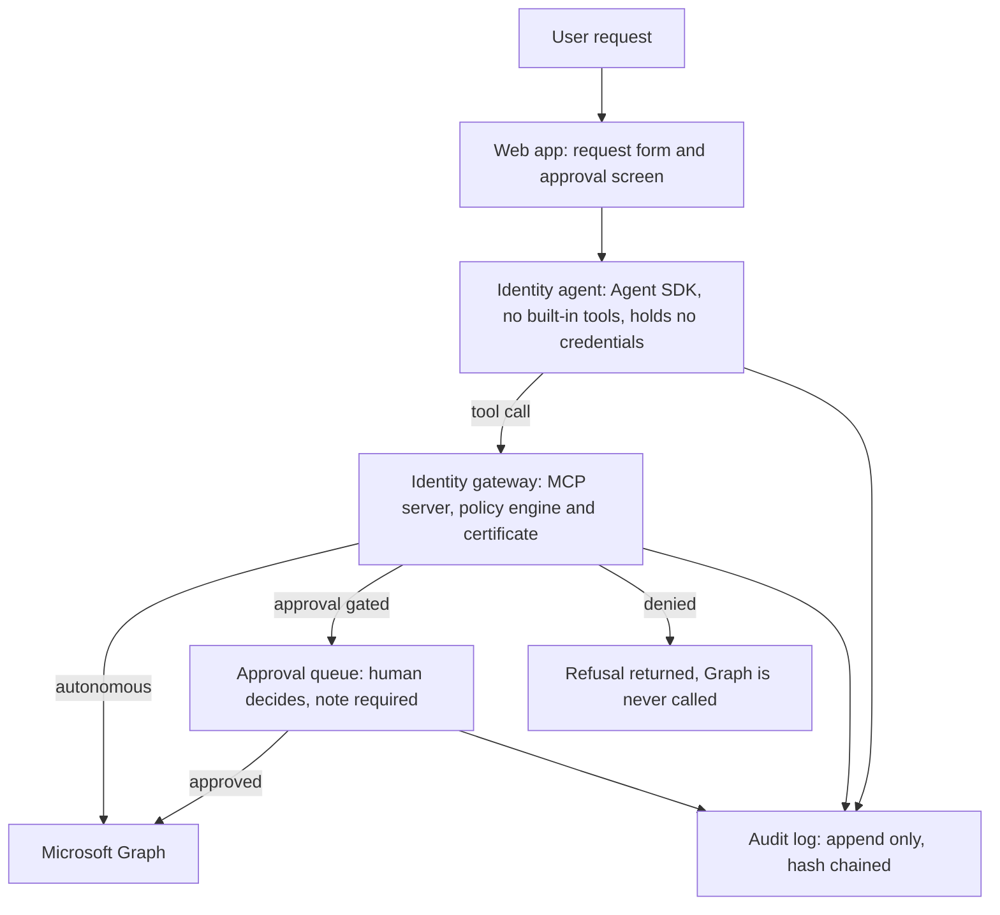

# scoped-agent-helpdesk

## What this is

This is a small identity helpdesk: a web form where someone can ask a question about group
membership or ask for a group membership change, an AI agent that answers the question or
requests the change, and a human approver who reviews and decides on any change before it
happens. The build contract is [SPRINT1.md](SPRINT1.md); this file explains the design and
records what has been verified against a real Microsoft Entra tenant.

The problem it addresses is a specific one. Once an AI agent has a tool that can change a
production identity system, the interesting question is not whether the agent is well
intentioned. It is what happens when the agent is wrong, or has been talked into something by
a user, or hallucinates a plausible sounding request. A system built on "the agent decides, and
we hope it decides well" has no floor. This project is an attempt to put a floor under an agent
with real access to Microsoft Graph: a policy engine that the agent cannot argue with, an audit
log that the agent cannot edit, and a human in the loop for anything that changes state.

The claim this project makes is narrow and testable, not "the system is secure." It is: every
action the agent can request falls into exactly one of three classes, decided by code the model
never touches, and every one of those decisions, including refusals, is recorded before
anything happens as a result of it. The rest of this document explains why that claim is worth
making this way, then records the evidence for it.



The certificate sits in the gateway, never on the agent side. An agent that is talked into
something still has no way to reach Graph on its own, and every decision reaches the audit log
before anything executes. In Sprint 1 the approval executor holds its own Graph credential
rather than calling back through the gateway, which is the one place this diagram simplifies.
That is listed as a Sprint 2 item.

## Action classes

Every request the agent makes ends up in exactly one of three classes. The policy engine
(`packages/gateway/src/policy/decide.ts`) decides which one; nothing else in the system gets a
vote.

**Autonomous.** Reads that carry no risk of changing anything: which groups is this user in,
what groups exist for the agent to talk about. These run immediately, with no approval and no
special scrutiny beyond the fact that they are still validated and still logged.

**Approval gated.** Anything that changes state: adding a user to a group. In Sprint 1 this
class has exactly one member, and it has no exceptions. There is no allowlist of "safe" groups
that skip review. Every group addition creates an approval record and waits for a human. The
agent is told, in its own tool description, that a pending result is the normal, successful
outcome of asking for a change, not a failure to work around.

**Never automated.** Anything the policy explicitly refuses regardless of who is asking or why:
targeting a directory role instead of a security group, targeting an account on the break glass
list, targeting a group that is not on the managed allowlist. These are refused before Microsoft
Graph is ever called. There is no path, no rephrasing, no amount of user insistence in the
request text that reaches a different outcome, because the refusal happens in code that never
reads the request text at all, only the validated tool name and parameters.

The definition of done for Sprint 1 is, in effect, one example from each class plus proof that
all three, including the refusal, appear in the same audit trail. That run is recorded near the
end of this document.

## Why enforcement is deterministic code, and the model is the exception path

The policy engine is a pure function. No network access, no model call, no randomness, no
system clock inside its own logic (time is passed in, not read). Given the same tool request
and the same configuration, it returns the same decision every time, and that decision can be
read straight out of the source code without running anything.

This is a deliberate rejection of the more common design, where a model is asked to judge
whether a request is safe and the judgment is trusted. A model's judgment is a distribution, not
a guarantee. It can be shifted by phrasing, by a long enough conversation, by a request that
looks unusually similar to ones it has seen approved before. None of that is a flaw you can fix
by writing a better prompt, because the underlying mechanism, a model producing a plausible
continuation, does not change. Deterministic code has a different failure mode: if a rule is
wrong, it is wrong the same way every time, in a way a reviewer can find by reading the rule.
That is a much better property for a control to have.

The model's job is narrower than "decide if this is safe." It is: understand what the user is
asking for in natural language, choose which of the three tools to call and with what
parameters, and report the result honestly, including a refusal or a pending approval. The
policy engine's decision is not a suggestion the model can override or reinterpret; it is the
tool call's actual result. A denied response tells the agent plainly that nothing happened and
names the rule, and the agent's system prompt tells it not to retry, not to look for another
route, and not to claim a change was made when it was not. The one place a model's judgment
does carry real weight, understanding an ambiguous request and asking a clarifying question
instead of guessing, is exactly where judgment is appropriate: before a tool is ever called, on
a request that has not yet touched policy or Graph.

## Identity is a spawn argument, never a tool parameter

The identity of the person on whose behalf a request is being made (the actor) is set once, when
the agent process and the gateway process for that session are started, as a command line
argument: `--actor alice@contoso.com`. It is never a field the model fills in, never something
read from the request text, and there is no tool parameter named anything like `userId` or
`onBehalfOf` that a prompt could persuade the model to set.

This matters because a tool parameter is something the conversation can influence. If identity
were a parameter, a sufficiently creative prompt could potentially get the model to pass a
different identity than the one actually asking, and the policy engine and audit log would
faithfully record the wrong actor. By binding identity at the process boundary instead, outside
anything the model's context window ever contains, there is no text the model could produce that
changes who the system believes is asking. The web form's identity field is a plain text input
in Sprint 1 (Entra login replaces it in Sprint 2), but it is still read once, at the start of the
request, and passed down through every layer as a parameter rather than being re-derived from
anything downstream.

## Nothing is rejected before it is audited

The call order inside every tool handler is fixed and the same for every tool: validate the
input shape, call the policy engine, commit an audit record for whatever the decision was, and
only then act on it. The audit write happens before the branch into "call Graph," "create an
approval," or "return a refusal," not after.

The reason for that specific order is what happens when something goes wrong partway through. If
the audit record were written after the action, a crash between the decision and the write would
mean an action happened (or a refusal was decided) with no evidence of it. Writing the record
first means the worst case is a crash that leaves a decision recorded with no result yet filled
in, which is still evidence of what was decided and when. The same principle applies at the
approval step: the human's verdict is written to the audit log, then recorded on the approval
itself, and only then is Microsoft Graph called. A crash after approval but before the Graph
call leaves an approved, unexecuted record rather than an unrecorded action.

The same ordering rule is why malformed input is not rejected at the protocol layer. A tool call
with garbage parameters still goes through the policy engine, which denies it by name, and the
denial, with the original malformed input attached, is what gets audited. Rejecting it earlier
would be more convenient, but it would also mean an agent sending nonsense leaves no trace,
which is exactly the kind of event the log exists to catch.

## The hash chain

Every audit record includes a sha256 hash of itself and the hash of the record before it. This
turns the append only table from something that is merely inconvenient to edit into something
where editing is detectable. Changing any field in any past record changes that record's hash,
which no longer matches what the next record says its predecessor's hash should be. Deleting a
record in the middle of the chain breaks the same link. `verifyChain()` walks the whole table
and returns the first place this breaks, or confirms the chain is intact.

This alone has one gap: it cannot see a record deleted or rewritten at the very end of the
chain, because there is no later record whose stored link would disagree. To close most of that
gap, the log also keeps a small marker outside the main table recording the id and hash of the
last record written, updated in the same transaction as every append. Comparing that marker
against the actual last record catches a deleted or rewritten tail. But this raises the bar
rather than closing the gap completely: anyone with write access to the database file can
rewrite the marker to match a rewritten tail, and at that point nothing inside the file can
prove anything is wrong. Closing that last gap needs the marker's hash published somewhere
outside the file, on a schedule, so a rewritten file can be compared against an earlier, external
record of what it used to say. That is called anchoring, and it is explicitly out of scope for
Sprint 1. The chain, on its own, is still worth having: it turns "we would probably notice" into
"here is the specific record that does not check out," which is a different order of evidence.

## The rationale generator never sees the agent's conversation

When a request needs approval, a short explanation is generated for the human reviewer: what is
being requested, what changes if it is approved, and what is worth checking before approving.
This text is written by a single, isolated call to a model. It has no tools, no memory of
previous calls, and no loop. Its only input is a fixed set of facts assembled by the gateway
after the policy decision has already been made: the tool name, the validated parameters, which
rule required approval, the target user, the target group, and who is asking. It never receives
the agent's conversation, the user's original wording, or anything the agent said in the course
of handling the request.

The reason for the isolation is that an agent's conversation is exactly the thing that might have
been manipulated. If a user has talked the agent into believing a request is more legitimate
than it is, and the rationale generator read that same conversation, it would likely produce a
rationale that reflects the same manipulation, dressed up as an independent-sounding
justification. A human reviewer reading a confident, well-written rationale is more likely to
trust it, which would turn the control meant to help the reviewer into a tool for defeating
their judgment. Rebuilding the rationale from raw, already-validated facts, with no path back to
the conversation, means whatever it says can be checked against the same facts the reviewer can
see directly above it. The generated text is stored exactly as returned and is always labeled as
generated. It is supporting information. It is never treated as a decision, and the interface
never lets it stand in for one: a missing or failed rationale still allows the human to decide,
and the approval screen says explicitly when no rationale was generated rather than showing
nothing.

## Why policy configuration lives in git, not in `.env`

The break glass list (accounts no request may ever target) and the managed group allowlist (the
only groups `add_user_to_group` may touch) are both hardcoded in
`packages/gateway/src/policy/config.ts` and committed to version control. This was a deliberate
choice against the more common pattern of putting this kind of configuration in environment
variables.

An environment variable can be changed by editing a file on a server, with no review, no
record of who changed it or when, and no diff to look at afterward. For most configuration that
is a reasonable tradeoff for convenience. For a break glass list or a group allowlist it is the
wrong tradeoff, because these are the specific values that decide whether the whole system's
main safety property holds. Putting them in git means a change to either one is a commit: it has
an author, a timestamp, a diff, and, in a normal workflow, a reviewer. Someone widening the
allowlist to include a group it should not include leaves the same kind of evidence a code change
would. The configuration is still validated automatically at startup (a malformed UPN or group id
in the file fails loudly rather than silently matching nothing), but the values themselves are
reviewable in exactly the way a `.env` file is not.

## Scope

### What Sprint 1 deliberately does not include

Microsoft Graph access uses a certificate credential (no client secrets). The gateway is
reachable only over stdio, on the same host as the agent that spawns it; there is no HTTP
transport and no OAuth on the gateway itself. The web app's identity field is a plain text
input; Entra login is not wired up. There is one agent, with no separate triage process and no
second agent type. There is no ledger anchoring for the audit chain (see above) and no prompt
injection test suite. None of this is an oversight; each is a named line SPRINT1.md draws on
purpose, so that Sprint 1 stays small enough to actually finish and be evaluated as a whole.

### Two known gaps carried forward

**The web app holds Microsoft Graph credentials directly.** When an approver approves a request,
something has to actually call Graph, and Sprint 1 has no HTTP transport on the gateway for the
web app to call into instead. So `packages/web/src/bin/web.ts` builds its own certificate
credential and Graph client and calls Graph itself. This is the same trust boundary as the
gateway process (a human only interface, never reachable by the model), not a new one, but it is
still a second process on disk with access to the private key. Sprint 2's HTTP transport should
let the web app reach the gateway instead of duplicating its credential handling.

**There is no `remove_user_from_group` tool.** `add_user_to_group` is the only write Sprint 1
built. Every live demonstration in this document that changed real tenant state was reverted
by hand, with a one-off Graph call made outside this codebase, not through anything the agent or
the web app can do. A remove path, with its own policy rule (most obviously: also gated on
approval, not autonomous), is a natural Sprint 2 addition if undoing a change needs to be
something the system supports rather than a manual escape hatch.

### What Sprint 2 is expected to add

HTTP transport and OAuth on the gateway, so each agent can run under its own service principal
instead of sharing the gateway's; Entra login on the web app, replacing the plain identity
field; a second agent and the triage logic to route between them (the seam for this already
exists as a placeholder function); ledger anchoring, to close the tail truncation gap the hash
chain leaves open; and a prompt injection test suite.

## Repo layout

```
packages/audit     the audit record format and its hash chain, shared, standalone
packages/gateway   MCP server, policy engine, Graph client, audit log (the only package with
                    credentials, other than the web app; see "Scope" above)
packages/agent     the identity agent, one file, on the Claude Agent SDK
packages/web       request form and approval screen, server rendered
data/              SQLite, gitignored
```

`packages/gateway/src/index.ts` documents two different rules for two different consumers. The
agent package may import only type definitions from the gateway package; it reaches the
gateway's actual behaviour over a spawned MCP connection it does not otherwise trust. The web
app, a human only interface, imports the gateway's runtime code directly, for the reason given
under "Scope" above.

## Running it

**Node 22.13 or newer is required.** The audit log uses the built in `node:sqlite` module,
which was unflagged in Node 22.13.0
([nodejs/node#55890](https://github.com/nodejs/node/pull/55890)); before that it either does not
exist or needs `--experimental-sqlite`. `openDatabase()` checks the running Node version at
startup and fails with a clear message rather than a cryptic import error. It still prints an
`ExperimentalWarning` on 22.x; the scripts in this repo run with `--no-warnings=ExperimentalWarning`
to suppress it. Nothing here is native code, so there is no build step and no `build-essential`
requirement on Linux; a Linux VPS should still use the NodeSource 22.x repository, `nvm`, or the
official tarball rather than a distro package, which is often older.

pnpm 12 manages the workspace (`npm install -g pnpm`; corepack could not write to Program Files
on the machine this was built on, hence the plain global install).

```
pnpm install
pnpm test
pnpm typecheck
pnpm build
```

Copy `.env.example` to `.env` and fill it in. `AZURE_TENANT_ID`, `AZURE_CLIENT_ID`,
`AZURE_CERT_THUMBPRINT`, and `AZURE_CERT_PATH` (the PEM private key, kept outside the repo) are
required for any Graph access. `ANTHROPIC_API_KEY` is optional; without it, approvals are still
created, just without a generated rationale, and the gateway says so at startup. Real
environment variables always take precedence over `.env`. The identity agent's own model turns
also need `ANTHROPIC_API_KEY` to resolve, but through a separate mechanism: the Agent SDK's own
Claude Code subprocess, which can authenticate from the same `.env` (the agent package loads it
independently at its own startup), a real environment variable, or an `ant auth login` profile.

Each package can be run directly once built:

```
pnpm gateway -- --actor alice@contoso.com --request-id test-1
pnpm agent -- --actor alice@contoso.com --request "which groups is alice@contoso.com in"
pnpm web
pnpm verify-audit [path/to/helpdesk.db]
```

## Status

| Component            | State                                                |
| --------------------- | ---------------------------------------------------- |
| 1. Policy engine      | done, tests first: `packages/gateway/src/policy`      |
| 2. Gateway            | done, tests first: `packages/gateway/src/tools`       |
| 3. Audit log          | done, tests first: `packages/audit`                   |
| 4. Approval store     | done, tests first: `packages/gateway/src/approvals`   |
| 5. Identity agent     | done, tests first: `packages/agent`                   |
| 6. Web                | done, tests first: `packages/web`                     |

283 tests across four packages, all passing; `pnpm typecheck` and `pnpm build` clean, at the
commit this document was written against.

### Policy engine notes

`decide(request, context, config)` is pure and never throws; anything it cannot evaluate is
denied and named (`deny.unknown_tool`, `deny.malformed_parameters`, `deny.policy_error`). Rule
tiers are checked in order (deny, then approval, then autonomous, then a default deny), and the
result lists every rule in the winning tier that matched, not just the first, so the audit log
carries the whole reason. Break glass applies to reads as well as writes: `list_user_groups` on a
break glass account is denied, not just `add_user_to_group`. The directory role id table
(`directory-roles.ts`) is a labelling aid, not the actual boundary: the managed group allowlist
is what stops a call, and an id missing from the role table is still denied by the allowlist
rule, just under a less specific name. The config file's shape is checked when it loads: a
malformed UPN or group id throws at startup rather than silently denying every request.

### Audit core notes

`packages/audit` (`@helpdesk/audit-core`) is a standalone workspace package holding only the
append only record format and its hash chain, used by both the gateway and the identity agent.
It deliberately carries no identity, no policy, no credentials, and no opinion on how or where
the underlying database file is opened; a caller passes in an already open connection. This
exists because there are two real writers (the gateway, and the identity agent, which writes its
own `request` and `no_tool_called` records because it is the only process that ever sees the
model's final reply text) and an earlier version of this project had the agent hand maintain its
own copy of the schema and hash algorithm rather than import gateway code. Two copies of a hash
algorithm is exactly the kind of thing that drifts silently, so once a second real writer
existed, the duplication was removed rather than managed. `AuditLog.append()` is synchronous and
transactional; every caller's audit-before-action ordering depends on that. Append only is
enforced twice, by database triggers and by the hash chain, so that removing the triggers alone
is not enough to edit history undetected. `pnpm verify-audit [path]` (built from the gateway
package) prints the log and the verification result, with a nonzero exit code on a broken chain.

### Graph client notes

The certificate credential flow (`private_key_jwt`) is hand rolled on `node:crypto` and `fetch`
rather than pulling in an auth library, since this is the only package meant to hold credentials
and the flow is short enough to read end to end. `GraphClient` exposes exactly two operations:
`listUserGroups` (group memberships only, directory roles and administrative units excluded, with
paging) and `addUserToGroup` (already being a member is reported as success). Inputs are
re-validated with the same schemas the policy engine uses before they are used to build a URL.
There is no retry on throttling yet; the tenant this was built against does not throttle at this
volume.

### Gateway notes

Three tools are exposed: `list_user_groups`, `list_managed_groups`, `add_user_to_group`. Tool
descriptions live in one file (`tools/descriptions.ts`), reviewed as prompt surface with tests
that pin the phrases that matter, most importantly that a pending approval is described as
success, not as something to retry around. The managed group allowlist is not embedded in any
description; the agent calls `list_managed_groups` to resolve a group name, and that call is
itself audited, so even "the agent asked what groups exist" is on the record. The MCP server is
built on the SDK's low level `Server` rather than the higher level tool registration helper,
because the latter validates arguments before a handler runs, and a call rejected there would
never reach the audit log. One gateway process runs per agent session, with identity bound at
spawn as described above.

### Approval store and rationale notes

The rationale generator is a single Messages API call, with a frozen system prompt asking for
the three sections described above and forbidding a recommendation either way. The approve and
reject path validates the approver's identity and the decision note, refuses and audits an
attempt where the approver and the original requester are the same person, records the human's
verdict, and only for an approval calls Graph and audits the result. All of this lives in the
gateway package; the web app calls into it and adds no rules of its own.

### Identity agent notes

The agent is one file, `packages/agent/src/identity-agent.ts`, running on the Claude Agent SDK
with every built in tool turned off and the allowed tool list naming exactly the three gateway
tools, so that nothing runs unless it is explicitly named rather than everything running unless
explicitly turned off. The gateway subprocess for a session is located by resolving the gateway
package's own `package.json`, never imported directly. The agent writes its own `request` and
`no_tool_called` audit records, using the shared audit package described above, since it is the
only process positioned to see whether the model ever called a tool and what it said if it did
not.

### Web app notes

Two server rendered pages on plain `node:http`, no framework and no build step for the UI. Every
value that ever came from a user, an agent, or a model is passed through an HTML escaping
function before it reaches a page. Route handling logic is written as plain functions
independent of HTTP and tested without starting a server; the HTTP layer itself is a thin
routing and body parsing wrapper, tested separately against a real server on an ephemeral port.
A missing rationale is rendered as an explicit sentence, never as a blank section.

## Sprint 1 verification run

This section records a live run of Sprint 1's definition of done against the real Entra tenant
this project was built against, plus a separate confirmation that the rationale generator
produces and stores real, three section text. Identifying details (tenant domain, object ids)
are from a disposable test tenant created for this project.

### A generated rationale, stored verbatim

A request to add a user to the Finance group was created through the gateway, with the rationale
generator enabled. The `rationale` audit record and the approval record's own `rationale` field
were compared and are identical. The stored text, exactly as generated:

```
What is being requested

helpdesk.operator@metehantestoutlook.onmicrosoft.com has submitted an add_user_to_group request
to place marcoasensio@metehantestoutlook.onmicrosoft.com into the group "Finance" (ID
88981a1a-1f6b-438c-9475-26b7c619dce0). The request is pending because the rule
approval.add_user_to_group requires approval. Parameters submitted: userPrincipalName
marcoasensio@metehantestoutlook.onmicrosoft.com, groupId 88981a1a-1f6b-438c-9475-26b7c619dce0.

What changes if approved

The target user becomes a member of the Finance group and gains whatever access, permissions,
licences, or mail/distribution behaviour that group membership confers. No other attributes of
the user or group are changed by this request.

What is worth checking before approving

Whether the group ID matches the intended "Finance" group, and what access that membership
grants. Whether the requesting operator is authorised to request membership changes for this
group and this user. Whether a ticket, owner approval, or justification exists, since none was
supplied here. Whether the membership should be time-limited.
```

All three required sections are present, in order, and the text matches the system prompt's
instructions: it draws only on the facts it was given and does not recommend a decision either
way. The request was then approved by a different identity, Graph reported the membership change
as executed, and the change was confirmed live against the tenant before being reverted.

### The full definition of done, in one pass, through the web app

All five definition of done items were exercised in a single session against one audit database,
entirely through the running web app (the request form and the approval screen), with no direct
gateway or Graph calls other than the confirmation and revert of tenant state afterward. The
audit records below are `pnpm verify-audit`'s output against that database, unedited except for
this note.

```
   1  2026-09-16T12:28:36.163Z  ae3847f2-...  helpdesk.operator@...  request        -
   2  2026-09-16T12:28:39.544Z  ae3847f2-...  helpdesk.operator@...  autonomous     list_user_groups
   3  2026-09-16T12:28:39.625Z  ae3847f2-...  helpdesk.operator@...  autonomous     list_user_groups => result
   4  2026-09-16T12:28:50.920Z  86b187a0-...  helpdesk.operator@...  request        -
   5  2026-09-16T12:28:53.899Z  86b187a0-...  helpdesk.operator@...  autonomous     list_managed_groups
   6  2026-09-16T12:28:53.903Z  86b187a0-...  helpdesk.operator@...  autonomous     list_managed_groups => result
   7  2026-09-16T12:28:55.459Z  86b187a0-...  helpdesk.operator@...  approval       add_user_to_group [approval.add_user_to_group]
   8  2026-09-16T12:29:01.735Z  86b187a0-...  helpdesk.operator@...  rationale      add_user_to_group => result
   9  2026-09-16T12:29:28.385Z  86b187a0-...  it.manager@...        approved       add_user_to_group [approval.add_user_to_group] => result
  10  2026-09-16T12:29:29.130Z  86b187a0-...  it.manager@...        approved       add_user_to_group [approval.add_user_to_group] => result
  11  2026-09-16T12:29:36.939Z  03062d1c-...  helpdesk.operator@...  request        -
  12  2026-09-16T12:29:44.732Z  03062d1c-...  helpdesk.operator@...  no_tool_called - => result

Chain intact: 12 record(s)
```

(UPNs and request ids are truncated above for width; the full values are ordinary test tenant
addresses and generated UUIDs, nothing sensitive.)

Reading the records against the five items:

1. Records 1 to 3: "which groups is alexdesouza@... in", asked through the request page, answered
   from a real `list_user_groups` call.
2. Records 4 to 7: "add marcoasensio@... to the Finance group", asked through the request page.
   The agent first called `list_managed_groups` to resolve the group name, then requested the
   add; the system did not perform it, and recorded a pending approval.
3. Records 7 to 10: opening the approval on the web app's approval screen showed the raw facts
   and the generated rationale (record 8); approving it with a different identity
   (`it.manager@...`, not the original requester) both audited the verdict and, on execution,
   audited the result of the real Graph call. The group membership change was confirmed live
   against the tenant, then reverted afterward using a one off Graph call outside this codebase
   (see "Scope").
4. Records 11 and 12: "assign alexdesouza@... the Global Administrator role", asked through the
   request page. The agent recognised this as a directory role, not a security group, and
   declined without calling any tool, hence `no_tool_called` rather than a policy denial; either
   way, Graph was never called.
5. All of the above, including the refusal, are in the one audit trail shown above, and
   `verifyChain()` reports the chain intact across all twelve records.
