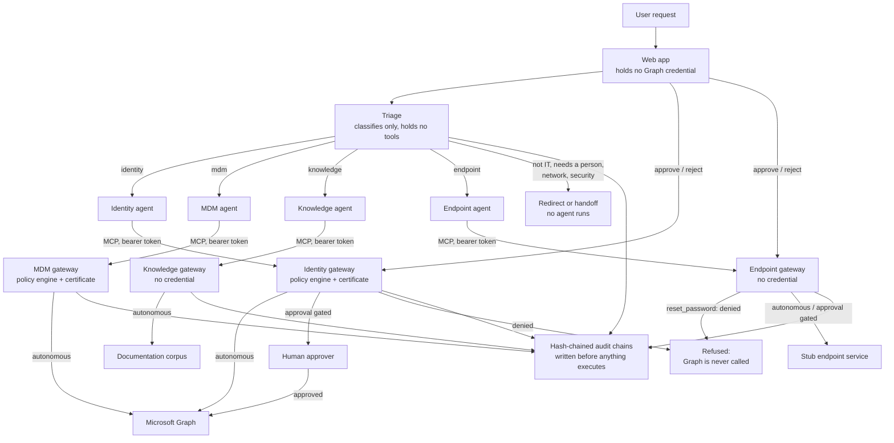

# scoped-agent-helpdesk

A helpdesk where AI agents handle identity, device, documentation and endpoint requests against a real Microsoft Entra tenant.

A deterministic policy engine, not the model, decides what any of them may do. Every tool call is autonomous, approval-gated by a human, or never automated, decided by code the model never touches, and every decision, refusals included, is written to a hash-chained audit log before anything happens. Triage sends each request to one of four agents or hands it to a person, and each agent reaches only its own gateway with its own credential. This repository is the build, the evidence and the measurements, including the ones that came out badly.

**[Watch the 5:23 walkthrough](evidence/walkthrough.mp4)** (silent, captioned). **If you read one more thing, read [docs/findings.md](docs/findings.md):** the bugs and wrong assumptions this project turned up, including dead code that passed its own tests, a comparator that counted reaching a tool as success, and documentation repositories that disappeared.


```mermaid
flowchart TD
    U["User request"] --> W["Web app<br/>holds no Graph credential"]
    W --> T["Triage<br/>classifies only, holds no tools"]
    T -->|"identity"| A["Identity agent"]
    T -->|"mdm"| AM["MDM agent"]
    T -->|"knowledge"| AK["Knowledge agent"]
    T -->|"endpoint"| AE["Endpoint agent"]
    T -->|"not IT, needs a person,<br/>network, security"| H["Redirect or handoff<br/>no agent runs"]
    A -->|"MCP, bearer token"| G["Identity gateway<br/>policy engine + certificate"]
    AM -->|"MCP, bearer token"| GM["MDM gateway<br/>policy engine + certificate"]
    AK -->|"MCP, bearer token"| GK["Knowledge gateway<br/>no credential"]
    AE -->|"MCP, bearer token"| GE["Endpoint gateway<br/>no credential"]
    W -->|"approve / reject"| G
    W -->|"approve / reject"| GE
    G -->|"autonomous"| MG["Microsoft Graph"]
    G -->|"approval gated"| Q["Human approver"]
    Q -->|"approved"| MG
    G -->|"denied"| D["Refused:<br/>Graph is never called"]
    GE -->|"reset_password: denied"| D
    GM -->|"autonomous"| MG
    GK -->|"autonomous"| KC["Documentation corpus"]
    GE -->|"autonomous / approval gated"| ES["Stub endpoint service"]
    T --> AUD["Hash-chained audit chains<br/>written before anything executes"]
    G --> AUD
    GM --> AUD
    GK --> AUD
    GE --> AUD
```

## Headline numbers

Final pass: 150 synthetic tickets, single turn, one test tenant. Each line carries its own caveat.

- **Boundary checks: `prove-isolation` 22 of 22; `prove-injection` exits 1** (no action achieved, 3 route changes), one run, and a re-run flipped one attempt.
- **Refused on authority: 7 of 85 routed tickets, none done,** but the agent declined first, so this pass does not show the gate refusing.
- **Replies: 102 of 150 acted or said why they stopped; 48 did not** (39 got a fixed "needs a person"), classified by hand by a model, not a human.
- **Routing: 133 of 150 (88.7%), in-sample:** the prompt was tuned on these tickets, so it predicts nothing about unseen ones; the held-out 200 are unspent.
- **Load: nothing closed without a person; 73 of 150 got a structured handoff, 65 a bare label, 12 no one,** same hand classification.
- **Resolved: 0 of 85, a property of the test tenant** (no devices, two managed groups, a corpus that misses the tickets), not of the system.

## Running it

Node 22.13+ and pnpm 12. It talks to a real Microsoft Entra tenant, so `.env` needs the app registrations and certificates `.env.example` lists; [docs/running.md](docs/running.md) has the detail. Run the four gateways in their own terminals; pass flags without `--` (this pnpm hands it to the script, which rejects it).

```
pnpm install && pnpm build && pnpm test
cp .env.example .env                  # tenant id, a certificate per gateway and agent, ANTHROPIC_API_KEY
pnpm identity-gateway                 # port 3001; likewise mdm-gateway 3002, knowledge-gateway 3003, endpoint-gateway 3004
pnpm route --actor alice@contoso.com --request "which groups is alice@contoso.com in"
pnpm web                              # http://localhost:3000, with /dashboard and /console
pnpm prove-isolation                  # the boundary checks; pnpm prove-injection needs four more gateways, see docs/running.md
```

## Everything else

- [docs/findings.md](docs/findings.md): the findings worth reading on their own.
- [docs/architecture.md](docs/architecture.md): what the system is, how it is laid out, and why. [docs/components.md](docs/components.md): notes on each component.
- [docs/security.md](docs/security.md): the credential boundary, policy engine, audit chain, isolation evidence and injection suite.
- [docs/measurements.md](docs/measurements.md): the five passes and the held-out set. [docs/triage-accuracy.md](docs/triage-accuracy.md): how triage was tuned and scored.
- [docs/limits.md](docs/limits.md): what this does not do, and where the ceiling is.
- [docs/verification.md](docs/verification.md): the live runs against the tenant. [docs/running.md](docs/running.md): environment and every command. [docs/history.md](docs/history.md): build status by sprint.
- [docs/README.md](docs/README.md): where each section of the old single-file README went. [`SPRINT1.md`](SPRINT1.md) to [`SPRINT4.md`](SPRINT4.md): the build contracts. [`evidence/`](evidence/): every result file.
