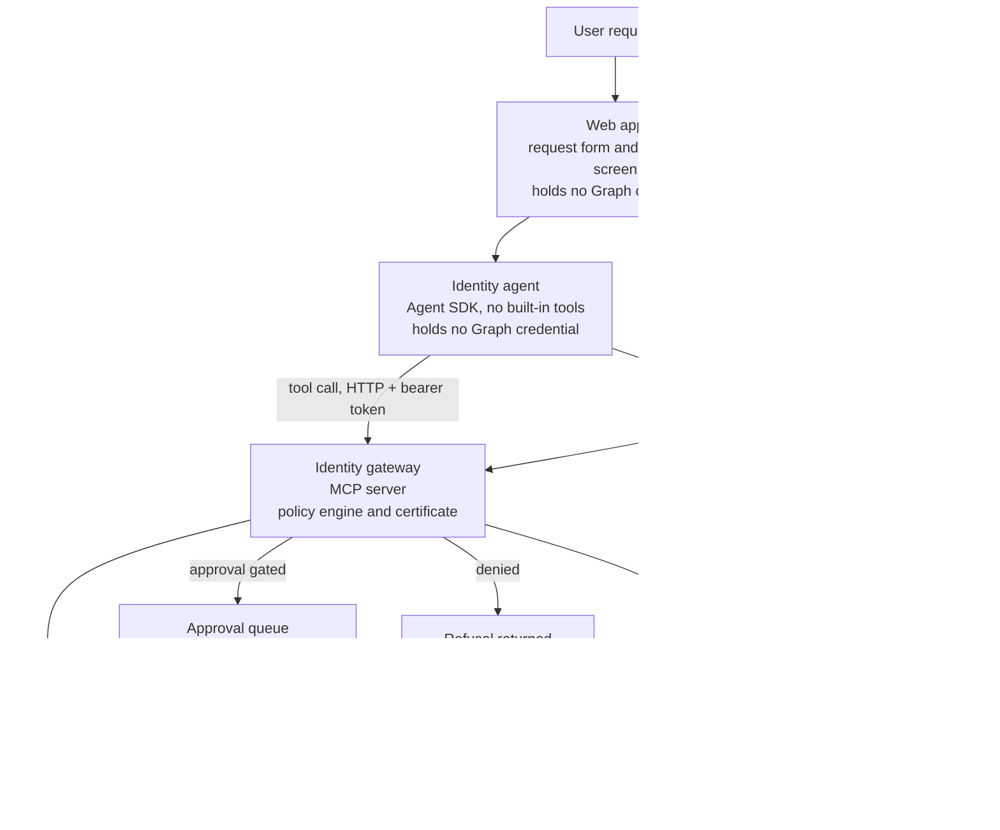

# scoped-agent-helpdesk

## What this is

This is a small identity helpdesk: a web form where someone can ask a question about group
membership or ask for a group membership change, an AI agent that answers the question or
requests the change, and a human approver who reviews and decides on any change before it
happens. The build contract is [SPRINT1.md](SPRINT1.md); this file explains the design and
records what has been verified against a real Microsoft Entra tenant.

The problem it addresses is a specific one. Once an AI agent has a tool that can change a
production identity system, the interesting question is not whether the agent is well
intentioned. It is what happens when the agent is wrong, or has been talked into something by
a user, or hallucinates a plausible sounding request. A system built on "the agent decides, and
we hope it decides well" has no floor. This project is an attempt to put a floor under an agent
with real access to Microsoft Graph: a policy engine that the agent cannot argue with, an audit
log that the agent cannot edit, and a human in the loop for anything that changes state.

The claim this project makes is narrow and testable, not "the system is secure." It is: every
action the agent can request falls into exactly one of three classes, decided by code the model
never touches, and every one of those decisions, including refusals, is recorded before
anything happens as a result of it. The rest of this document explains why that claim is worth
making this way, then records the evidence for it.


```mermaid
flowchart TD
    U["User request"] --> W["Web app<br/>request form and approval screen<br/>holds no Graph credential"]
    W --> A["Identity agent<br/>Agent SDK, no built-in tools<br/>holds no Graph credential"]
    A -->|"tool call, HTTP + bearer token"| G["Identity gateway<br/>MCP server<br/>policy engine and certificate"]
    W -->|"approve/reject, HTTP + bearer token"| G

    G -->|"autonomous"| MG["Microsoft Graph"]
    G -->|"approval gated"| Q["Approval queue<br/>human decides, note required"]
    Q -->|"approved"| MG
    G -->|"denied"| D["Refusal returned<br/>Graph is never called"]

    A --> L["Audit log<br/>append only, hash chained"]
    G --> L
```

The certificate sits in the gateway, never on the agent side and, as of Sprint 2 Stage B, never
on the web app's side either. An agent that is talked into something still has no way to reach
Graph on its own, and every decision reaches the audit log before anything executes. Through
Stage A the approval executor held its own Graph credential in the web app rather than calling
back through the gateway, the one place this diagram simplified; Stage B closed that (see "Stage
B: the web app becomes a gateway client" below), and the diagram above reflects the closed state.

## Action classes

Every request the agent makes ends up in exactly one of three classes. The policy engine
(`packages/identity-gateway/src/policy/decide.ts`) decides which one; nothing else in the system gets a
vote.

**Autonomous.** Reads that carry no risk of changing anything: which groups is this user in,
what groups exist for the agent to talk about. These run immediately, with no approval and no
special scrutiny beyond the fact that they are still validated and still logged.

**Approval gated.** Anything that changes state: adding a user to a group, or (as of Sprint 2)
removing one. Neither has any exceptions. There is no allowlist of "safe" groups that skip
review, and removal is not treated as lower-risk than addition. Every group change creates an
approval record and waits for a human. The agent is told, in its own tool description, that a
pending result is the normal, successful outcome of asking for a change, not a failure to work
around.

**Never automated.** Anything the policy explicitly refuses regardless of who is asking or why:
targeting a directory role instead of a security group, targeting an account on the break glass
list, targeting a group that is not on the managed allowlist. These are refused before Microsoft
Graph is ever called. There is no path, no rephrasing, no amount of user insistence in the
request text that reaches a different outcome, because the refusal happens in code that never
reads the request text at all, only the validated tool name and parameters.

The definition of done for Sprint 1 is, in effect, one example from each class plus proof that
all three, including the refusal, appear in the same audit trail. That run is recorded near the
end of this document.

## Why enforcement is deterministic code, and the model is the exception path

The policy engine is a pure function. No network access, no model call, no randomness, no
system clock inside its own logic (time is passed in, not read). Given the same tool request
and the same configuration, it returns the same decision every time, and that decision can be
read straight out of the source code without running anything.

This is a deliberate rejection of the more common design, where a model is asked to judge
whether a request is safe and the judgment is trusted. A model's judgment is a distribution, not
a guarantee. It can be shifted by phrasing, by a long enough conversation, by a request that
looks unusually similar to ones it has seen approved before. None of that is a flaw you can fix
by writing a better prompt, because the underlying mechanism, a model producing a plausible
continuation, does not change. Deterministic code has a different failure mode: if a rule is
wrong, it is wrong the same way every time, in a way a reviewer can find by reading the rule.
That is a much better property for a control to have.

The model's job is narrower than "decide if this is safe." It is: understand what the user is
asking for in natural language, choose which tool to call and with what
parameters, and report the result honestly, including a refusal or a pending approval. The
policy engine's decision is not a suggestion the model can override or reinterpret; it is the
tool call's actual result. A denied response tells the agent plainly that nothing happened and
names the rule, and the agent's system prompt tells it not to retry, not to look for another
route, and not to claim a change was made when it was not. The one place a model's judgment
does carry real weight, understanding an ambiguous request and asking a clarifying question
instead of guessing, is exactly where judgment is appropriate: before a tool is ever called, on
a request that has not yet touched policy or Graph.

## Identity is bound outside the model's reach, never a tool parameter

The identity of the person on whose behalf a request is being made (the actor) is read once, at
the start of a request, from a place the model's context window never contains, and carried
through every layer as a parameter rather than re-derived from anything downstream. In Sprint 1
that place was a command-line argument the agent process passed straight through to the gateway
subprocess it spawned: `--actor alice@contoso.com`, bound once per session because the gateway
itself was one process per session. Stage B's gateways are long-running HTTP servers with no
per-session process to bind an argument to, so the actor now travels as an `x-actor` HTTP header
the agent process sets on every request — the mechanism changed, the property did not: it is
still something the agent's own code sets from its own caller, never a field the model fills in,
never something read from the request text, and there is no tool parameter named anything like
`userId` or `onBehalfOf` that a prompt could persuade the model to set.

This matters because a tool parameter is something the conversation can influence. If identity
were a parameter, a sufficiently creative prompt could potentially get the model to pass a
different identity than the one actually asking, and the policy engine and audit log would
faithfully record the wrong actor. By binding identity outside the model's reach instead —
a spawn argument in Sprint 1, a header the agent process sets in Stage B — there is no text the
model could produce that changes who the system believes is asking. The web form's identity
field is a plain text input in Sprint 1 (Entra login replaces it in a later sprint), but it is
still read once, at the start of the request, the same way.

Stage B adds a second identity alongside the actor: which *agent* is calling, taken from the
validated bearer token's own client id rather than a matching `--agent` CLI flag nothing verified
before. See "Stage B: HTTP transport and token validation" below for the detail.

## Nothing is rejected before it is audited

The call order inside every tool handler is fixed and the same for every tool: validate the
input shape, call the policy engine, commit an audit record for whatever the decision was, and
only then act on it. The audit write happens before the branch into "call Graph," "create an
approval," or "return a refusal," not after.

The reason for that specific order is what happens when something goes wrong partway through. If
the audit record were written after the action, a crash between the decision and the write would
mean an action happened (or a refusal was decided) with no evidence of it. Writing the record
first means the worst case is a crash that leaves a decision recorded with no result yet filled
in, which is still evidence of what was decided and when. The same principle applies at the
approval step: the human's verdict is written to the audit log, then recorded on the approval
itself, and only then is Microsoft Graph called. A crash after approval but before the Graph
call leaves an approved, unexecuted record rather than an unrecorded action.

The same ordering rule is why malformed input is not rejected at the protocol layer. A tool call
with garbage parameters still goes through the policy engine, which denies it by name, and the
denial, with the original malformed input attached, is what gets audited. Rejecting it earlier
would be more convenient, but it would also mean an agent sending nonsense leaves no trace,
which is exactly the kind of event the log exists to catch.

## The hash chain

Every audit record includes a sha256 hash of itself and the hash of the record before it. This
turns the append only table from something that is merely inconvenient to edit into something
where editing is detectable. Changing any field in any past record changes that record's hash,
which no longer matches what the next record says its predecessor's hash should be. Deleting a
record in the middle of the chain breaks the same link. `verifyChain()` walks the whole table
and returns the first place this breaks, or confirms the chain is intact.

This alone has one gap: it cannot see a record deleted or rewritten at the very end of the
chain, because there is no later record whose stored link would disagree. To close most of that
gap, the log also keeps a small marker outside the main table recording the id and hash of the
last record written, updated in the same transaction as every append. Comparing that marker
against the actual last record catches a deleted or rewritten tail. But this raises the bar
rather than closing the gap completely: anyone with write access to the database file can
rewrite the marker to match a rewritten tail, and at that point nothing inside the file can
prove anything is wrong. Closing that last gap needs the marker's hash published somewhere
outside the file, on a schedule, so a rewritten file can be compared against an earlier, external
record of what it used to say. That is called anchoring, and it is explicitly out of scope for
Sprint 1. The chain, on its own, is still worth having: it turns "we would probably notice" into
"here is the specific record that does not check out," which is a different order of evidence.

## The rationale generator never sees the agent's conversation

When a request needs approval, a short explanation is generated for the human reviewer: what is
being requested, what changes if it is approved, and what is worth checking before approving.
This text is written by a single, isolated call to a model. It has no tools, no memory of
previous calls, and no loop. Its only input is a fixed set of facts assembled by the gateway
after the policy decision has already been made: the tool name, the validated parameters, which
rule required approval, the target user, the target group, and who is asking. It never receives
the agent's conversation, the user's original wording, or anything the agent said in the course
of handling the request.

The reason for the isolation is that an agent's conversation is exactly the thing that might have
been manipulated. If a user has talked the agent into believing a request is more legitimate
than it is, and the rationale generator read that same conversation, it would likely produce a
rationale that reflects the same manipulation, dressed up as an independent-sounding
justification. A human reviewer reading a confident, well-written rationale is more likely to
trust it, which would turn the control meant to help the reviewer into a tool for defeating
their judgment. Rebuilding the rationale from raw, already-validated facts, with no path back to
the conversation, means whatever it says can be checked against the same facts the reviewer can
see directly above it. The generated text is stored exactly as returned and is always labeled as
generated. It is supporting information. It is never treated as a decision, and the interface
never lets it stand in for one: a missing or failed rationale still allows the human to decide,
and the approval screen says explicitly when no rationale was generated rather than showing
nothing.

## Why policy configuration lives in git, not in `.env`

The break glass list (accounts no request may ever target) and the managed group allowlist (the
only groups `add_user_to_group` may touch) are both hardcoded in
`packages/identity-gateway/src/policy/config.ts` and committed to version control. This was a deliberate
choice against the more common pattern of putting this kind of configuration in environment
variables.

An environment variable can be changed by editing a file on a server, with no review, no
record of who changed it or when, and no diff to look at afterward. For most configuration that
is a reasonable tradeoff for convenience. For a break glass list or a group allowlist it is the
wrong tradeoff, because these are the specific values that decide whether the whole system's
main safety property holds. Putting them in git means a change to either one is a commit: it has
an author, a timestamp, a diff, and, in a normal workflow, a reviewer. Someone widening the
allowlist to include a group it should not include leaves the same kind of evidence a code change
would. The configuration is still validated automatically at startup (a malformed UPN or group id
in the file fails loudly rather than silently matching nothing), but the values themselves are
reviewable in exactly the way a `.env` file is not.

## Scope

### What Sprint 1 deliberately does not include

Microsoft Graph access uses a certificate credential (no client secrets). The gateway is
reachable only over stdio, on the same host as the agent that spawns it; there is no HTTP
transport and no OAuth on the gateway itself. The web app's identity field is a plain text
input; Entra login is not wired up. There is one agent, with no separate triage process and no
second agent type. There is no ledger anchoring for the audit chain (see above) and no prompt
injection test suite. None of this is an oversight; each is a named line SPRINT1.md draws on
purpose, so that Sprint 1 stays small enough to actually finish and be evaluated as a whole.

### Two known gaps carried forward from Sprint 1 — both now closed

**The web app held Microsoft Graph credentials directly. Closed in Sprint 2, Stage B.** When an
approver approved a request, something had to actually call Graph, and Sprint 1 had no HTTP
transport on the gateway for the web app to call into instead. So `packages/web/src/bin/web.ts`
built its own certificate credential and Graph client and called Graph itself. Stage B's HTTP
transport removed that entirely: the web app now holds no Graph credential and no `GraphClient`
at all, and reaches Graph only by asking the identity gateway (which still holds the one Graph
credential) to execute an already-decided approval — see "Stage B: the web app becomes a gateway
client" below.

**There was no `remove_user_from_group` tool. Closed in Sprint 2, Stage A.** `add_user_to_group`
was the only write Sprint 1 built, so every live demonstration in this document that changed
real tenant state had to be reverted by hand, with a one-off Graph call made outside this
codebase. `remove_user_from_group` now exists on the identity gateway (Component 3), approval
gated, the same class as the addition with no exceptions. It needed no new deny rule: extending
the existing rules' notion of "target group" to cover this tool as well as `add_user_to_group`
was enough for the directory-role and managed-allowlist deny rules to apply to it automatically,
confirmed in `policy/decide.test.ts` rather than assumed. The demo revert now runs through the
same audited, approved path as the change itself, instead of a manual escape hatch — exercised
live in the Sprint 2 verification run below.

### What Sprint 2, Stage A adds

Two disjoint identities: a second app registration, `helpdesk-mdm-gateway`, with exactly one
Graph permission (`Device.Read.All`) and its own certificate. A new package,
`packages/mdm-gateway`, exposing `list_devices` and `get_device` (both autonomous, no write
tools, its own policy engine and its own audit chain and database file). A second agent,
`packages/agent/src/mdm-agent.ts`, the identity agent's device-lookup counterpart — its own file,
its own system prompt, its own tool allowlist, no shared constant between the two (see "The MDM
agent, and the weaker boundary above the gateways" below for what that boundary does and does not
prove today). `pnpm prove-isolation`, committed evidence that Microsoft — not this codebase —
refuses a credential pointed at the other gateway's resource. And `remove_user_from_group`,
above.

### What Sprint 2, Stage B adds

HTTP transport on both gateways (`StreamableHTTPServerTransport`, stateless), replacing stdio,
with a bearer token validated on every request: signature against the tenant's published keys,
audience equal to that gateway's own Application ID URI, the `Gateway.Invoke` app role present.
Each agent gets its own app registration and certificate for the first time, scoped to its own
gateway's audience and carrying no Graph permission at all, so the agent-level tool boundary
Stage A's own README section called "our own code" becomes something Entra enforces instead —
`pnpm prove-isolation` grew two checks that prove exactly that, live. The web app losing its
Graph credential (above). `remove_user_from_group`'s demo revert exercised through the real web
UI with no manual Graph call, also above. See "Stage B: HTTP transport and token validation" and
"Stage B: the web app becomes a gateway client" below for the detail, and the Sprint 2
verification run for all of it exercised together in one session.

### What is still open after Sprint 2

A merged, read-only view across the two gateways' separate audit chains (SPRINT2.md, Component 6
describes this as a small reader that verifies each chain independently before merging by
`requestId`; not built, since nothing in this sprint's definition of done requires it — each
chain already verifies clean on its own, which is what Component 6's actual requirement asks
for). The MCP authorization specification describes a fuller model than Stage B implements:
discovery metadata, dynamic client registration, resource indicators. This sprint stops at
audience-bound tokens against Entra; see "Stage B: HTTP transport and token validation" below for
what that gap means in practice. Carried forward unchanged from Sprint 1: Entra login on the web
app, replacing the plain identity field; the triage logic to route between the two agents that
now exist (the seam for this already exists as a placeholder function, unused by either agent so
far); ledger anchoring, to close the tail truncation gap the hash chain leaves open; and a prompt
injection test suite.

## Repo layout

```
packages/audit             the audit record format and its hash chain, shared, standalone
packages/identity-gateway  identity gateway: MCP-over-HTTP server, policy engine, Graph client,
                           audit log, token validation (auth/), the approval decision endpoint
                           (approvals/decision-listener.ts) — the only package that holds a Graph
                           credential; the Graph and auth plumbing is shared with
                           packages/mdm-gateway, see the header comments in graph/client.ts and
                           index.ts
packages/mdm-gateway       MDM gateway: its own MCP-over-HTTP server, policy engine and audit
                           chain, disjoint Graph permission and certificate from the identity
                           gateway (SPRINT2.md)
packages/agent             two agents, one file each (identity-agent.ts, mdm-agent.ts), on the
                           Claude Agent SDK; deliberately not one parameterized implementation
                           (see mdm-agent.ts's header comment); each holds its own certificate,
                           scoped to its own gateway's audience, with no Graph permission
packages/web               request form and approval screen, server rendered; holds no Graph
                           credential (SPRINT2.md, Stage B) — reaches Graph only by asking the
                           identity gateway to execute an already-decided approval
data/                      SQLite, gitignored
```

`packages/identity-gateway/src/index.ts` documents the rules for its three consumers (the agent
package, the MDM gateway package, and the web app) in detail — see that file for exactly which
runtime values each may import and why. The short version: everyone gets type definitions freely;
the one shared runtime credential class (`CertificateCredential`) is a deliberate, narrow
exception for the agent package and the web app, both of which use it only to authenticate to a
gateway, never to Graph; nothing outside `packages/identity-gateway` imports `GraphClient`,
the policy engine, or `ApprovalWorkflow`.

## Running it

**Node 22.13 or newer is required.** The audit log uses the built in `node:sqlite` module,
which was unflagged in Node 22.13.0
([nodejs/node#55890](https://github.com/nodejs/node/pull/55890)); before that it either does not
exist or needs `--experimental-sqlite`. `openDatabase()` checks the running Node version at
startup and fails with a clear message rather than a cryptic import error. It still prints an
`ExperimentalWarning` on 22.x; the scripts in this repo run with `--no-warnings=ExperimentalWarning`
to suppress it. Nothing here is native code, so there is no build step and no `build-essential`
requirement on Linux; a Linux VPS should still use the NodeSource 22.x repository, `nvm`, or the
official tarball rather than a distro package, which is often older.

pnpm 12 manages the workspace (`npm install -g pnpm`; corepack could not write to Program Files
on the machine this was built on, hence the plain global install).

```
pnpm install
pnpm test
pnpm typecheck
pnpm build
```

Copy `.env.example` to `.env` and fill it in. `AZURE_TENANT_ID` is shared, one directory; each
gateway and each agent gets its own client id, certificate thumbprint and PEM private key path
(kept outside the repo) — the identity and MDM gateways' own Graph-scoped credentials
(`AZURE_IDENTITY_*` / `AZURE_MDM_*`), each gateway's own Application ID URI
(`IDENTITY_GATEWAY_AUDIENCE` / `MDM_GATEWAY_AUDIENCE`), and each agent's own certificate, scoped
to its gateway's audience and carrying no Graph permission (`AZURE_IDENTITY_AGENT_*` /
`AZURE_MDM_AGENT_*`, SPRINT2.md Stage B). `ANTHROPIC_API_KEY` is optional; without it, approvals
are still created, just without a generated rationale, and the gateway says so at startup. Real
environment variables always take precedence over `.env`. Both agents' own model turns also
need `ANTHROPIC_API_KEY` to resolve, but through a separate mechanism: the Agent SDK's own
Claude Code subprocess, which can authenticate from the same `.env` (the agent package loads it
independently at its own startup), a real environment variable, or an `ant auth login` profile.

**Both gateways are long-running HTTP servers as of Stage B, not one process per agent session.**
Start them first, in their own terminals, before running an agent or the web app — there is
nothing left for either to spawn:

```
pnpm identity-gateway [--port 3001] [--db data/identity-helpdesk.db]
pnpm mdm-gateway [--port 3002] [--db data/mdm-helpdesk.db]
```

With both running, everything else can be run directly once built:

```
pnpm agent --actor alice@contoso.com --request "which groups is alice@contoso.com in"
pnpm mdm-agent --actor alice@contoso.com --request "list the devices in the tenant"
pnpm web
pnpm verify-audit [path/to/identity-helpdesk.db]
pnpm graph-smoke
pnpm mdm-graph-smoke
pnpm token-smoke
pnpm prove-isolation
```

No `--` before the flags: these scripts chain a build step before `node ...` with `&&`, and on
this pnpm version a `--` separator is passed straight through as a literal argument to the built
script, which then rejects it. Plain trailing flags work because pnpm appends them to the whole
script line.

`pnpm mdm-gateway` defaults to `data/mdm-helpdesk.db`, a separate file from the identity
gateway's `data/identity-helpdesk.db` (SPRINT2.md, Component 6: two gateways, two audit chains,
never merged); `pnpm verify-audit` takes either path and needs no changes to work against both.
`pnpm prove-isolation`'s last three checks need the gateways they target already running and
reachable — see its own header comment.

## Status

| Component            | State                                                |
| --------------------- | ---------------------------------------------------- |
| 1. Policy engine      | done, tests first: `packages/identity-gateway/src/policy`      |
| 2. Gateway            | done, tests first: `packages/identity-gateway/src/tools`       |
| 3. Audit log          | done, tests first: `packages/audit`                   |
| 4. Approval store     | done, tests first: `packages/identity-gateway/src/approvals`   |
| 5. Identity agent     | done, tests first: `packages/agent`                   |
| 6. Web                | done, tests first: `packages/web`                     |

283 tests across four packages, all passing; `pnpm typecheck` and `pnpm build` clean, at the
commit this document was written against.

### Sprint 2, Stage A status

| Component                    | State                                                                  |
| ----------------------------- | ------------------------------------------------------------------------ |
| 1. MDM gateway                | done, tests first: `packages/mdm-gateway`                                 |
| 2. Isolation evidence         | done: `pnpm prove-isolation`, `evidence/isolation-run.txt`                 |
| 3. `remove_user_from_group`   | done, tests first: `packages/identity-gateway/src/policy`, `src/tools`    |
| 4. MDM agent                  | done, tests first: `packages/agent/src/mdm-agent.ts`                      |

Stage A is complete.

### Sprint 2, Stage B status

| Component                             | State                                                                 |
| --------------------------------------- | ------------------------------------------------------------------------ |
| 1. Agent credentials                    | done, live: `pnpm token-smoke`                                           |
| 2. HTTP transport                       | done, tests first: `packages/identity-gateway/src/tools/http-listener.ts` |
| 3. Token validation                     | done, tests first: `packages/identity-gateway/src/auth`                  |
| 4. Cross-gateway and endpoint-coverage proof | done: `pnpm prove-isolation` (7 checks), `evidence/isolation-run.txt` |
| 5. Web app loses its Graph credential    | done, tests first: `packages/identity-gateway/src/approvals/decision-listener.ts` |
| 6. Both audit chains verify clean       | done — see the Sprint 2 verification run below                          |

Stage B is complete. Sprint 2's full definition of done is exercised end to end in the
verification run below.

427 tests across six packages, all passing; `pnpm typecheck` and `pnpm build` clean, at the
commit this document was written against.

### Policy engine notes

`decide(request, context, config)` is pure and never throws; anything it cannot evaluate is
denied and named (`deny.unknown_tool`, `deny.malformed_parameters`, `deny.policy_error`). Rule
tiers are checked in order (deny, then approval, then autonomous, then a default deny), and the
result lists every rule in the winning tier that matched, not just the first, so the audit log
carries the whole reason. Break glass applies to reads as well as writes: `list_user_groups` on a
break glass account is denied, not just `add_user_to_group`. The directory role id table
(`directory-roles.ts`) is a labelling aid, not the actual boundary: the managed group allowlist
is what stops a call, and an id missing from the role table is still denied by the allowlist
rule, just under a less specific name. The config file's shape is checked when it loads: a
malformed UPN or group id throws at startup rather than silently denying every request.

### Audit core notes

`packages/audit` (`@helpdesk/audit-core`) is a standalone workspace package holding only the
append only record format and its hash chain, used by all four writers as of Stage B: both
gateways and both agents (each agent still writes its own `request` and `no_tool_called` records
directly, for the reason below; each gateway writes everything else, including — as of Stage B —
a rejected token, and the identity gateway's approval decisions). It deliberately carries no
identity, no policy, no credentials, and no opinion on how or where
the underlying database file is opened; a caller passes in an already open connection. This
exists because there are two real writers (the gateway, and the identity agent, which writes its
own `request` and `no_tool_called` records because it is the only process that ever sees the
model's final reply text) and an earlier version of this project had the agent hand maintain its
own copy of the schema and hash algorithm rather than import gateway code. Two copies of a hash
algorithm is exactly the kind of thing that drifts silently, so once a second real writer
existed, the duplication was removed rather than managed. `AuditLog.append()` is synchronous and
transactional; every caller's audit-before-action ordering depends on that. Append only is
enforced twice, by database triggers and by the hash chain, so that removing the triggers alone
is not enough to edit history undetected. `pnpm verify-audit [path]` (built from the gateway
package) prints the log and the verification result, with a nonzero exit code on a broken chain.

### Graph client notes

The certificate credential flow (`private_key_jwt`) is hand rolled on `node:crypto` and `fetch`
rather than pulling in an auth library, since this is the only package meant to hold Graph
credentials for the identity gateway and the flow is short enough to read end to end. As of
Sprint 2, `GraphClient` is also what `packages/mdm-gateway` imports for its own, separately
credentialed calls (see the file's own header comment for why that is sharing code, not sharing
configuration). It exposes: `listUserGroups` (group memberships only, directory roles and
administrative units excluded, with paging), `addUserToGroup` and `removeUserFromGroup` (already
being a member, or already not being one, is not specially handled for removal the way it is for
addition — Graph's 404 on removing a non-member propagates as an ordinary `GraphError`, since
SPRINT2.md's Component 3 does not ask for idempotency here), and `listDevices` / `getDevice`
(paging for the list; a 404 on `getDevice` propagates rather than returning null, since this one
is model-facing, unlike the identity-only `getGroup`). Inputs are re-validated with the same
schemas the policy engines use before they are used to build a URL. There is no retry on
throttling yet; the tenant this was built against does not throttle at this volume.

### Gateway notes

Four tools are exposed: `list_user_groups`, `list_managed_groups`, `add_user_to_group`,
`remove_user_from_group`. Tool descriptions live in one file (`tools/descriptions.ts`), reviewed
as prompt surface with tests that pin the phrases that matter, most importantly that a pending
approval is described as success, not as something to retry around — true for both writes now,
not just the addition. The managed group allowlist is not embedded in any description; the agent
calls `list_managed_groups` to resolve a group name, and that call is itself audited, so even
"the agent asked what groups exist" is on the record. The MCP server is built on the SDK's low
level `Server` rather than the higher level tool registration helper, because the latter
validates arguments before a handler runs, and a call rejected there would never reach the audit
log. As of Stage B, one gateway process is a long-running HTTP server, not one process per agent
session: `sessionFromExtra()` in `tools/server.ts` derives a fresh `SessionContext` for every
tool call from the validated token (`agent`, the token's own client id) and from the
`x-actor`/`x-request-id` headers the calling agent sets itself (`actor`, `requestId`) — never
from the tool call's own arguments. A stateless `StreamableHTTPServerTransport` cannot be reused
across requests, so `bin/gateway.ts` builds a fresh `Server` and transport pair per request over
the same shared dependencies (the audit log, the Graph client, ...), which is cheap: it only
registers handlers, it does not reopen anything. `packages/mdm-gateway` repeats this shape
independently — its own `tools/`, its own policy engine, its own MCP server identifying as
`helpdesk-mdm-gateway` — rather than parameterizing this package to serve both gateways, so that
the two remain two things a reviewer can reason about separately, the same argument SPRINT2.md's
Component 6 makes for the audit chains.

### Approval store and rationale notes

The rationale generator is a single Messages API call, with a frozen system prompt asking for
the three sections described above and forbidding a recommendation either way. The approve and
reject path (`ApprovalWorkflow`) validates the approver's identity and the decision note, refuses
and audits an attempt where the approver and the original requester are the same person, records
the human's verdict, and only for an approval calls Graph and audits the result. `ApprovalWorkflow`
itself has not changed since Sprint 1; what changed in Stage B is where it runs. Through Stage A
the web app instantiated it directly, in its own process, with its own `GraphClient`. As of Stage
B it runs only inside the identity gateway process, reached through a non-MCP HTTP endpoint,
`approvals/decision-listener.ts` (`POST /approvals/decide`) — deliberately not an MCP tool, since
approving or rejecting is a human-only action and putting it on the MCP surface would put it
within an agent's potential reach. Authenticated the same way as the MCP endpoint (bearer token,
`Gateway.Invoke`), on its own path, since the JSON body here (`approvalId`, `decidedBy`,
`decision`, `note`) is a genuine payload from a human-only UI, not a concern the MCP path's
header-based identity has to guard against. The web app calls into it over HTTP and adds no rules
of its own, same as it always has.

### Identity agent notes

The agent is one file, `packages/agent/src/identity-agent.ts`, running on the Claude Agent SDK
with every built in tool turned off and the allowed tool list naming exactly the four gateway
tools, so that nothing runs unless it is explicitly named rather than everything running unless
explicitly turned off. Through Stage A the gateway ran as a subprocess this file spawned and
located by resolving the gateway package's own `package.json`, never imported directly. As of
Stage B there is no subprocess: the gateway is a long-running HTTP server, and this file connects
to it as an ordinary MCP-over-HTTP client, minting its own bearer token first
(`CertificateCredential`, scoped to `IDENTITY_GATEWAY_AUDIENCE`, the one runtime import this
package takes from the gateway package — see that package's `index.ts` for why this specific
class is safe to share) and sending `x-actor`/`x-request-id` as headers the model never sees or
sets. The agent writes its own `request` and `no_tool_called` audit records, using the shared
audit package described above, since it is the only process positioned to see whether the model
ever called a tool and what it said if it did not.

### Web app notes

Two server rendered pages on plain `node:http`, no framework and no build step for the UI. Every
value that ever came from a user, an agent, or a model is passed through an HTML escaping
function before it reaches a page. Route handling logic is written as plain functions
independent of HTTP and tested without starting a server; the HTTP layer itself is a thin
routing and body parsing wrapper, tested separately against a real server on an ephemeral port.
A missing rationale is rendered as an explicit sentence, never as a blank section. As of Stage B
this package holds no Graph credential: `decideApproval()` in `approvals-page.ts` is unchanged
(it still just calls `deps.decide(input)` and catches `ApprovalError`), but `web.ts`'s
composition root now backs `decide` with an HTTP call to the identity gateway's decision
endpoint rather than an in-process `ApprovalWorkflow`, reconstructing an `ApprovalError` from the
gateway's JSON error response so that unchanged catch block keeps working. `ApprovalStore` stays
a direct read against the shared SQLite file for listing and displaying approvals — a read needs
no credential and was never the gap Stage B closes.

## Sprint 1 verification run

This section records a live run of Sprint 1's definition of done against the real Entra tenant
this project was built against, plus a separate confirmation that the rationale generator
produces and stores real, three section text. Identifying details (tenant domain, object ids)
are from a disposable test tenant created for this project.

### A generated rationale, stored verbatim

A request to add a user to the Finance group was created through the gateway, with the rationale
generator enabled. The `rationale` audit record and the approval record's own `rationale` field
were compared and are identical. The stored text, exactly as generated:

```
What is being requested

helpdesk.operator@metehantestoutlook.onmicrosoft.com has submitted an add_user_to_group request
to place marcoasensio@metehantestoutlook.onmicrosoft.com into the group "Finance" (ID
88981a1a-1f6b-438c-9475-26b7c619dce0). The request is pending because the rule
approval.add_user_to_group requires approval. Parameters submitted: userPrincipalName
marcoasensio@metehantestoutlook.onmicrosoft.com, groupId 88981a1a-1f6b-438c-9475-26b7c619dce0.

What changes if approved

The target user becomes a member of the Finance group and gains whatever access, permissions,
licences, or mail/distribution behaviour that group membership confers. No other attributes of
the user or group are changed by this request.

What is worth checking before approving

Whether the group ID matches the intended "Finance" group, and what access that membership
grants. Whether the requesting operator is authorised to request membership changes for this
group and this user. Whether a ticket, owner approval, or justification exists, since none was
supplied here. Whether the membership should be time-limited.
```

All three required sections are present, in order, and the text matches the system prompt's
instructions: it draws only on the facts it was given and does not recommend a decision either
way. The request was then approved by a different identity, Graph reported the membership change
as executed, and the change was confirmed live against the tenant before being reverted.

### The full definition of done, in one pass, through the web app

All five definition of done items were exercised in a single session against one audit database,
entirely through the running web app (the request form and the approval screen), with no direct
gateway or Graph calls other than the confirmation and revert of tenant state afterward. The
audit records below are `pnpm verify-audit`'s output against that database, unedited except for
this note.

```
   1  2026-09-16T12:28:36.163Z  ae3847f2-...  helpdesk.operator@...  request        -
   2  2026-09-16T12:28:39.544Z  ae3847f2-...  helpdesk.operator@...  autonomous     list_user_groups
   3  2026-09-16T12:28:39.625Z  ae3847f2-...  helpdesk.operator@...  autonomous     list_user_groups => result
   4  2026-09-16T12:28:50.920Z  86b187a0-...  helpdesk.operator@...  request        -
   5  2026-09-16T12:28:53.899Z  86b187a0-...  helpdesk.operator@...  autonomous     list_managed_groups
   6  2026-09-16T12:28:53.903Z  86b187a0-...  helpdesk.operator@...  autonomous     list_managed_groups => result
   7  2026-09-16T12:28:55.459Z  86b187a0-...  helpdesk.operator@...  approval       add_user_to_group [approval.add_user_to_group]
   8  2026-09-16T12:29:01.735Z  86b187a0-...  helpdesk.operator@...  rationale      add_user_to_group => result
   9  2026-09-16T12:29:28.385Z  86b187a0-...  it.manager@...        approved       add_user_to_group [approval.add_user_to_group] => result
  10  2026-09-16T12:29:29.130Z  86b187a0-...  it.manager@...        approved       add_user_to_group [approval.add_user_to_group] => result
  11  2026-09-16T12:29:36.939Z  03062d1c-...  helpdesk.operator@...  request        -
  12  2026-09-16T12:29:44.732Z  03062d1c-...  helpdesk.operator@...  no_tool_called - => result

Chain intact: 12 record(s)
```

(UPNs and request ids are truncated above for width; the full values are ordinary test tenant
addresses and generated UUIDs, nothing sensitive.)

Reading the records against the five items:

1. Records 1 to 3: "which groups is alexdesouza@... in", asked through the request page, answered
   from a real `list_user_groups` call.
2. Records 4 to 7: "add marcoasensio@... to the Finance group", asked through the request page.
   The agent first called `list_managed_groups` to resolve the group name, then requested the
   add; the system did not perform it, and recorded a pending approval.
3. Records 7 to 10: opening the approval on the web app's approval screen showed the raw facts
   and the generated rationale (record 8); approving it with a different identity
   (`it.manager@...`, not the original requester) both audited the verdict and, on execution,
   audited the result of the real Graph call. The group membership change was confirmed live
   against the tenant, then reverted afterward using a one off Graph call outside this codebase
   (see "Scope").
4. Records 11 and 12: "assign alexdesouza@... the Global Administrator role", asked through the
   request page. The agent recognised this as a directory role, not a security group, and
   declined without calling any tool, hence `no_tool_called` rather than a policy denial; either
   way, Graph was never called.
5. All of the above, including the refusal, are in the one audit trail shown above, and
   `verifyChain()` reports the chain intact across all twelve records.

## Sprint 2: gateway isolation, at two layers

[SPRINT2.md](SPRINT2.md) opens a second app registration, `helpdesk-mdm-gateway`, with exactly
one Graph permission (`Device.Read.All`) and its own certificate, disjoint from the identity
gateway's (`User.Read.All`, `GroupMember.ReadWrite.All`). The claim worth demonstrating is not
"our code keeps these separate" but "Microsoft keeps these separate, and would refuse a mistake
even if our code did not." Stage B adds a second layer to the same claim: each agent's own token,
valid for its own gateway, presented to the *other* gateway must be refused too — this time by
this codebase's own token validation, since there is no Graph call involved to ask Microsoft to
refuse on our behalf. A third question sits below both: does the identity gateway's *other*
authenticated endpoint — `/approvals/decide`, which is not an MCP tool call at all — enforce the
same check, or did it get its own, separately written (and possibly separately wrong) one?
`pnpm prove-isolation` (`packages/identity-gateway/src/bin/prove-isolation.ts`) checks all three
questions, seven calls in total, and fails the build if any of them does not come back exactly as
expected. The result is committed at [evidence/isolation-run.txt](evidence/isolation-run.txt) and
reproduced here:

```
Sprint 2: gateway isolation, Graph-level (Stage A, Component 2) and gateway-level (Stage B, Components 3-4)
Run at: 2026-09-18T08:09:31.284Z
Tenant: f5590adf-b4c2-43c0-a656-5fb76451a2b7

check                                     expected    actual    roles                               error code
--------------------------------------------------------------------------------------------------------------------
identity token -> GET /users              200         200       User.Read.All, GroupMember.ReadWrite.All  -
identity token -> GET /devices            403         403       User.Read.All, GroupMember.ReadWrite.All  Authorization_RequestDenied
mdm token -> GET /devices                 200         200       Device.Read.All                     -
mdm token -> GET /users                   403         403       Device.Read.All                     Authorization_RequestDenied
identity agent token -> MDM gateway       401         401       Gateway.Invoke                      token_audience_mismatch
MDM agent token -> identity gateway       401         401       Gateway.Invoke                      token_audience_mismatch
no token -> POST /approvals/decide        401         401       (none)                              token_missing_token

PASS: all 7 checks matched their expected outcome.
```

The first four checks are Stage A's: the identity gateway's own token is refused by Graph itself
(403, `Authorization_RequestDenied`) when pointed at `/devices`, and the MDM gateway's token is
refused the same way when pointed at `/users`. Neither refusal is enforced by anything in this
repo; both come from Entra evaluating the `roles` claim each token actually carries. Checks five
and six are Stage B's cross-gateway proof: each *agent's* token — valid for its own gateway,
carrying `Gateway.Invoke` — is refused by the *other* gateway with a 401 naming the audience
mismatch (`token_audience_mismatch`), enforced by `TokenValidator` in this repo, and audited on
the refusing gateway's own chain as `deny.audience_mismatch`. Check seven is the endpoint-coverage
proof: `bin/gateway.ts` constructs exactly one `TokenValidator` and hands the same instance to
both `createRequestListener` (the MCP endpoint) and `createDecisionListener` (the approval
endpoint) — confirmed by reading the source, then confirmed live rather than left as a
code-reading claim, since it is exactly the kind of thing a future refactor could quietly break
by giving the second listener its own, independently-written check that drifts from the first. A
bare request to `/approvals/decide` with no `Authorization` header at all comes back `401
token_missing_token`, audited as `deny.missing_token` with `actor: "unknown"`. Manually confirmed
further while building this check, though not itself part of the automated script: a request
bearing a *validly signed, currently valid* token — the MDM agent's own — presented to the
identity gateway's decision endpoint is refused with `token_audience_mismatch`, the same as check
six, proving the endpoint checks the full claim set (signature, issuer, audience, role) and not
merely "is a bearer header present." The script prints every token's `roles` claim so each row is
checkable against the app registration, not just against the script's own good faith. Never
logged: a bearer token or the client assertion used to obtain it, only decoded claims and error
codes.

**What this proves, and what it does not.** It proves that Microsoft enforces the Graph-level
separation between the two app registrations' permissions, and that this codebase's own token
validation enforces the gateway-level separation between the two agents' credentials: an agent
holding one gateway's token cannot use it to act as the other, and neither credential can reach
Graph directly at all. It does **not** prove that the MDM gateway's process cannot read the
identity gateway's certificate off disk, or vice versa; that is a host-level concern, not a
Graph- or token-level one, and Sprint 2 addresses it only by naming it: run the two gateways
under separate OS users, or on separate hosts, so that a compromise of one process's filesystem
access does not hand over the other's private key. That separation is not exercised by this
script or by anything else in this repo yet.

### The MDM agent, and the boundary above the gateways

`packages/agent/src/mdm-agent.ts` is the device-lookup counterpart to `identity-agent.ts`: same
shape, zero built-in tools, `allowedTools` naming exactly the two `mdm-gateway` tools, its own
`request` and `no_tool_called` audit records written into the MDM gateway's own database. It is a
separate file with its own system prompt text, not a parameterized copy of the identity agent
sharing a constant with it — see the file's own header comment for why: a shared allowlist or
prompt constant would quietly become the thing that defines the boundary between the two agents,
and the boundary is supposed to come from credentials.

`agent-boundary.test.ts` checks the two agents' `allowedTools` never intersect and that each
names only its own gateway's MCP server. **This is a real check, but through Stage A it was a
weaker one than `prove-isolation.ts` above, and it was worth being honest about the difference at
the time.** The Stage A isolation evidence proved something an attacker could not talk their way
around: Entra refuses a Graph call made with the wrong gateway's credential, regardless of what
code ran on either side of it. The agent-boundary test only proved something a *reviewer* could
not easily miss: that nothing stopped a future edit to `mdm-agent.ts` from adding
`"mcp__identity-gateway__add_user_to_group"` to its own `allowedTools` by mistake, except this
test catching it and a reviewer reading the diff. Stage B closed that gap at the layer where it
actually matters: each agent now holds its own app registration and certificate, authenticating
it to its own gateway's HTTP endpoint and to no other, verified by signature and audience by
Entra on every call — the two checks `prove-isolation.ts` added above. An agent naming the wrong
tool today fails not because a test caught it in CI, but because the gateway it would have to
reach refuses the token outright, live, the same class of proof the Graph-level checks already
demonstrated one layer down. `agent-boundary.test.ts` still runs, and still earns its place: it
catches the mistake in seconds during development, before anyone needs a live tenant to notice.

## Stage B: agents get a credential

Sprint 1 deliberately avoided giving the agent process a credential of any kind — "the actor
identity is a spawn-time parameter... nothing the model produces can set or change it" depended
on the gateway, not the agent, holding anything worth protecting. Stage B changes that, and the
change is safe for a specific, checkable reason: each agent's certificate is scoped to exactly
one Application ID URI (its own gateway's), obtained via the ordinary OAuth client-credentials
flow, and the app registration behind it has **zero Graph permissions** — confirmed live, not
assumed, by `pnpm token-smoke` (`packages/agent/src/bin/token-smoke.ts`), which mints a real
token for each agent and asserts its `roles` claim is exactly `["Gateway.Invoke"]`, nothing more.
A credential that cannot reach Graph cannot be used to bypass the gateway even if it were stolen
outright; the worst it can do is call tools the gateway itself would still run through `decide()`
and the audit log, exactly as if the agent had called them normally.

`CertificateCredential` (`packages/identity-gateway/src/graph/certificate-credential.ts`) is
reused for this, unchanged: it was already generic — tenant, client id, thumbprint and a private
key as constructor parameters, no embedded knowledge of Graph or of any specific credential. That
genericity is what makes reusing it safe: SPRINT1.md's rule that the agent package may import
only type definitions from the gateway package held throughout Sprint 1 and Stage A because
nothing the agent could import was safe to run with the agent's own trust level. `CertificateCredential`
is the one narrow, deliberate exception — the agent uses it only to authenticate itself to its
own gateway, never to Graph, so importing it does not reopen the door the original rule closed.
The agent package still imports nothing else from the gateway package's runtime surface: no
`GraphClient`, no policy engine, no Graph credential.

## Stage B: HTTP transport and token validation

Both gateways now run `StreamableHTTPServerTransport` in stateless mode (no `sessionIdGenerator`)
instead of stdio. Stateless mode has one hard constraint worth naming because it shapes
`bin/gateway.ts` directly: a stateless transport throws if `handleRequest` runs on it twice, and
an MCP `Server` already connected to one transport refuses to connect to a second. So each
gateway builds a fresh `Server` and transport pair **per HTTP request**, over the same shared,
already-open dependencies (the audit log, the Graph client, the policy config) — cheap, since
building the pair only registers a few JSON-RPC handlers, it does not reopen anything.

Token validation (`packages/identity-gateway/src/auth/`) is hand-rolled claims plumbing around
`node:crypto`'s own primitives, not a JWT library: `JwksClient` fetches and caches a tenant's RSA
signing keys from Entra's discovery endpoint, converting each JWK straight into a `KeyObject` via
`crypto.createPublicKey({ key: jwk, format: "jwk" })`; `TokenValidator` then checks, in order,
that the header names `RS256` and a known `kid`, that `crypto.verify("RSA-SHA256", ...)` confirms
the signature against that key, that the token is not expired or not-yet-valid, that the issuer
names this tenant, that the audience equals this gateway's own Application ID URI, and that
`Gateway.Invoke` is present in the `roles` claim. The actual cryptographic verification is
`node:crypto`'s own, already vetted; nothing here reimplements RSA. Every one of those checks is
exercised with a real, freshly generated RSA keypair and a hand-signed test JWT in
`verify-token.test.ts` — including a deliberately tampered payload against an unchanged signature,
and a token signed by a key the tenant never published — not just asserted as intended behaviour.

A rejected token is checked and audited **before** `transport.handleRequest` ever runs
(`tools/http-listener.ts`, shared by both gateways): by the time a request would reach the MCP
layer, there is no HTTP status code left to return, so the refusal has to happen one layer out.
401 for a bad token (naming the specific reason — `deny.audience_mismatch`, `deny.expired`,
`deny.missing_role`, and so on — as its own audit rule), 400 for a token that validates but is
missing the `x-actor` or `x-request-id` header the calling agent must set itself. Both are
audited before the response is written, the same audit-before-action ordering Sprint 1 already
established for tool calls. Once a request passes both checks, `agent` in the resulting audit
record is the token's own validated client id — a real change in kind, not just mechanism: over
stdio, `--agent identity-agent` was a free-text CLI flag nothing verified; over HTTP, it is an
Entra-issued application id that Microsoft, not this repo, vouches for.

**A real-world discovery, not merely a documented possibility.** Verifying this live surfaced
that Entra issues a **v1.0** token (`iss: https://sts.windows.net/{tenant}/`) for a custom API
resource unless that resource's own app manifest sets `accessTokenAcceptedVersion: 2`, in which
case it issues a v2.0 token (`iss: https://login.microsoftonline.com/{tenant}/v2.0`) instead.
Neither app registration here has that manifest setting, so both gateways see v1.0 tokens in
practice. `TokenValidator` accepts either issuer shape for the configured tenant — both are
equally verifiable, and which one Entra happens to issue is a token-format detail, not a
security relaxation. This is exactly the kind of thing a live tenant catches that a design
document cannot.

**Gateways never forward the incoming token to Graph, on purpose.** Each gateway keeps minting
its own Graph token from its own certificate, exactly as it always has; the bearer token a
request arrives with is used only to authenticate that request to *this* gateway, and is
discarded once `sessionFromExtra()` has read the client id off it. Forwarding a caller's token
upstream is the pattern the MCP authorization specification explicitly warns against, and for
good reason: it would make this gateway's Graph access only as narrow as whatever the caller's
token happened to be scoped to, which defeats the entire point of a gateway minting its own,
independently-scoped credential.

**Known gap, named rather than solved.** The MCP authorization specification describes a fuller
model than Stage B implements: discovery metadata so a client can find out how to authenticate
without being told out of band, dynamic client registration, RFC 8707 resource indicators tying
a token to a specific resource at request time. This sprint implements audience-bound tokens
issued by Entra and stops there — `x-actor`/`x-request-id` as plain headers rather than a richer
identity-propagation mechanism is part of the same deliberate stop. A reader who knows the
specification will recognise the gap; naming it here is more honest than an overstated claim.

## Stage B: the web app becomes a gateway client

Through Stage A, `packages/web/src/bin/web.ts` built its own `CertificateCredential` and
`GraphClient` and called Graph directly whenever an approver approved a request — the last place
in the system where a Graph write happened outside the audited, gateway-mediated path, carried
forward from Sprint 1 because there was no HTTP transport yet for it to call into instead. Stage
B deletes both entirely: no flag, no fallback, no code path left in the web app that can construct
a Graph credential.

`ApprovalWorkflow` did not change; where it runs did. It now lives inside the identity gateway
process, which already holds the Graph client, reached through a new endpoint,
`approvals/decision-listener.ts` (`POST /approvals/decide`), authenticated the same way as the
MCP endpoint — a bearer token, `Gateway.Invoke` required — but deliberately **not** an MCP tool:
approving or rejecting a request is a human-only action, and putting it on the model-facing MCP
surface would put it within an agent's potential reach, undoing the separation of requester and
approver the rest of this document argues for. The JSON body this endpoint reads
(`approvalId`, `decidedBy`, `decision`, `note`) is a genuine request payload from a human filling
in a form on a human-only interface, not a model — so, unlike the MCP path, there is no "identity
from the body" concern to guard against here, and `decidedBy` is read from the body rather than a
header on purpose.

The web app authenticates to this endpoint by **reusing the identity agent's own app
registration** (`AZURE_IDENTITY_AGENT_*`) rather than requesting a third identity: it already
holds `Gateway.Invoke` on the identity gateway and nothing else, which is exactly the footing a
human-only caller of this one gateway needs, and a separate app registration here would add an
Azure identity without adding a real boundary. `approvals-page.ts` and `server.ts` did not need
to change at all: `decideApproval()` still just calls `deps.decide(input)` and catches
`ApprovalError` by `instanceof`, and `web.ts`'s new HTTP client reconstructs an `ApprovalError`
from the gateway's JSON error response so that unchanged code keeps working, unaware whether the
answer came from an in-process call or over HTTP. `ApprovalStore` stays a direct read against the
shared SQLite file for listing and displaying approvals: a read needs no credential and was never
the gap this component closes.

## Sprint 2 verification run

This section records a live run of Sprint 2's full definition of done against the same Entra
tenant Sprint 1 was verified against, both gateways running as long-running HTTP servers on
their default ports, the web app holding no Graph credential. Identifying details (tenant
domain, object ids) are from the same disposable test tenant used throughout this document.

### The full definition of done, in one session

1. **Two app registrations with disjoint Graph permissions.** `pnpm prove-isolation`'s first
   four checks, above: the identity gateway's token succeeds against `/users` and is refused
   (403) against `/devices`; the MDM gateway's token succeeds against `/devices` and is refused
   (403) against `/users`.
2. **Both gateways run over HTTP and validate a bearer token on every request.** Confirmed by
   every check below succeeding only with a valid, correctly-scoped token attached, and by the
   `deny.audience_mismatch` and `deny.missing_token` refusals immediately after.
3. **An agent holding an identity gateway token is refused by the MDM gateway with a 401 naming
   audience mismatch, and the refusal is audited.** `pnpm prove-isolation`'s checks five and six,
   above: both directions, both `401 token_audience_mismatch`, both audited on the refusing
   gateway's own chain as `deny.audience_mismatch` (record 20 on the identity chain, record 4 on
   the MDM chain, below).
4. **The identity gateway's own token, pointed at a Graph device endpoint, returns 403.** Row 2
   of `pnpm prove-isolation`'s output, above, and committed at
   [evidence/isolation-run.txt](evidence/isolation-run.txt).
5. **The web app no longer holds a Graph credential.** Verified structurally (`CertificateCredential`
   and `GraphClient` are not imported anywhere in `packages/web`) and behaviourally: records 4–10
   below show an approval submitted, rationale-generated, and **executed against the real
   tenant** entirely through `http://localhost:3000`, the real web form and the real approval
   screen, with the web process holding nothing that could call Graph directly.
6. **`remove_user_from_group` exists, approval gated, and the demo revert needs no manual Graph
   call.** Records 11–19 below: the same add was reverted through the same web UI, same audited,
   approved path, `remove_user_from_group` this time. No Graph call was made outside this
   codebase for either direction.
7. **Each gateway owns its own audit chain, and both verify clean after a full run.** `pnpm
   verify-audit data/identity-helpdesk.db` and `pnpm verify-audit data/mdm-helpdesk.db`, both
   reproduced below, both report every record intact.

Also confirmed in this session, beyond Sprint 2's original seven: **the approval-decision
endpoint enforces the same token validation as the MCP endpoint**, not a separately written check
that could drift from it. `pnpm prove-isolation`'s seventh check, above: a bare request to
`/approvals/decide` with no bearer token at all comes back `401 token_missing_token`, audited as
record 21 on the identity chain below.

### The identity gateway's chain (21 records)

```
   1  2026-09-18T08:12:39.550Z  59e721fe-...  helpdesk.operator@...  request        -
   2  2026-09-18T08:12:43.603Z  59e721fe-...  helpdesk.operator@...  autonomous     list_user_groups
   3  2026-09-18T08:12:43.770Z  59e721fe-...  helpdesk.operator@...  autonomous     list_user_groups => result
   4  2026-09-18T08:12:59.003Z  15df504f-...  helpdesk.operator@...  request        -
   5  2026-09-18T08:13:02.901Z  15df504f-...  helpdesk.operator@...  autonomous     list_managed_groups
   6  2026-09-18T08:13:02.903Z  15df504f-...  helpdesk.operator@...  autonomous     list_managed_groups => result
   7  2026-09-18T08:13:04.717Z  15df504f-...  helpdesk.operator@...  approval       add_user_to_group [approval.add_user_to_group]
   8  2026-09-18T08:13:10.971Z  15df504f-...  helpdesk.operator@...  rationale      add_user_to_group => result
   9  2026-09-18T08:13:32.198Z  15df504f-...  it.manager@...         approved       add_user_to_group [approval.add_user_to_group] => result
  10  2026-09-18T08:13:32.495Z  15df504f-...  it.manager@...         approved       add_user_to_group [approval.add_user_to_group] => result
  11  2026-09-18T08:13:54.927Z  b94fa282-...  helpdesk.operator@...  request        -
  12  2026-09-18T08:14:02.668Z  b94fa282-...  helpdesk.operator@...  no_tool_called - => result
  13  2026-09-18T08:14:24.046Z  38b873cd-...  helpdesk.operator@...  request        -
  14  2026-09-18T08:14:28.018Z  38b873cd-...  helpdesk.operator@...  autonomous     list_managed_groups
  15  2026-09-18T08:14:28.022Z  38b873cd-...  helpdesk.operator@...  autonomous     list_managed_groups => result
  16  2026-09-18T08:14:29.631Z  38b873cd-...  helpdesk.operator@...  approval       remove_user_from_group [approval.remove_user_from_group]
  17  2026-09-18T08:14:35.405Z  38b873cd-...  helpdesk.operator@...  rationale      remove_user_from_group => result
  18  2026-09-18T08:14:56.349Z  38b873cd-...  it.manager@...         approved       remove_user_from_group [approval.remove_user_from_group] => result
  19  2026-09-18T08:14:56.654Z  38b873cd-...  it.manager@...         approved       remove_user_from_group [approval.remove_user_from_group] => result
  20  2026-09-18T08:15:30.693Z  prove-isolation-b35761bd-...  prove-isolation@local  denied  - [deny.audience_mismatch]
  21  2026-09-18T08:15:30.698Z  7871abd8-...            unknown                       denied  - [deny.missing_token]

Chain intact: 21 record(s), data/identity-helpdesk.db
```

Reading it: records 1–3 are "which groups is alexdesouza@... in", asked through the request page
— an autonomous read, no approval involved. Records 4–10 are "add marcoasensio@... to the
Finance group", asked through the request page, approved by a different identity
(`it.manager@...`) through the real approval screen, and **executed against the real tenant** —
record 10 is the Graph result, written by the identity gateway process, which is the only
process in this run that ever held a Graph credential. Records 11–12 are "assign alexdesouza@...
the Global Administrator role", declined by the model without calling any tool — `no_tool_called`,
not a policy denial, and still on the record either way. Records 13–19 are the revert: "remove
marcoasensio@... from the Finance group", same approval screen, same audited path, `remove_user_from_group`
this time. Record 20 is `pnpm prove-isolation`'s identity-agent-token-against-MDM-gateway check
landing on *this* chain — the MDM gateway refused it, and audited the refusal here, on the
identity gateway's own chain, since that is where the (refused) attempt actually originated.
Record 21 is the new seventh check: a request to this gateway's own `/approvals/decide` with no
token at all, refused and audited here, `actor: "unknown"` since there was no header to read one
from.

### The MDM gateway's chain (4 records)

```
   1  2026-09-18T08:15:12.798Z  92724ff0-...  helpdesk.operator@...  request     -
   2  2026-09-18T08:15:16.586Z  92724ff0-...  helpdesk.operator@...  autonomous  list_devices
   3  2026-09-18T08:15:16.896Z  92724ff0-...  helpdesk.operator@...  autonomous  list_devices => result
   4  2026-09-18T08:15:30.601Z  prove-isolation-62f83cbf-...  prove-isolation@local  denied  - [deny.audience_mismatch]

Chain intact: 4 record(s), data/mdm-helpdesk.db
```

Records 1–3 are "list the devices in the tenant", asked through the real MDM agent
(`pnpm mdm-agent`) — the web app has no route to the MDM gateway at all, since Sprint 2
deliberately leaves triage between agents as a placeholder (see "What is still open after Sprint
2"). The tenant has no devices registered, and an empty list is exactly the successful result
SPRINT2.md's Component 1 describes. Record 4 is the mirror image of the identity chain's record
20: the MDM agent's token, presented to the identity gateway, refused there and audited on *this*
chain, since that is where the (refused) attempt actually originated.

Both chains verify intact, independently, on two separate database files that were never merged
— the last of Sprint 2's definition of done, and the same property Sprint 1 closed on.
