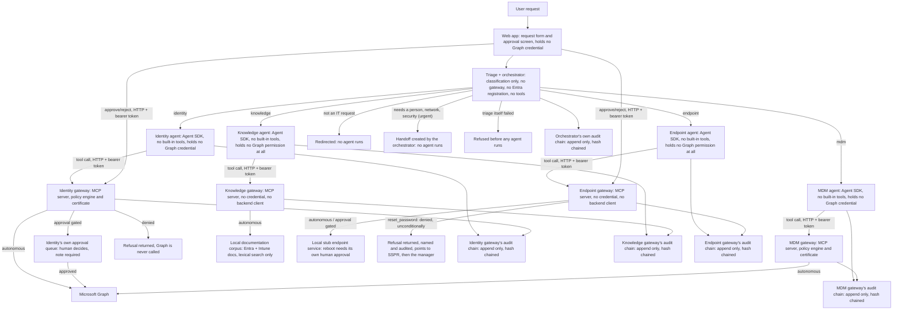
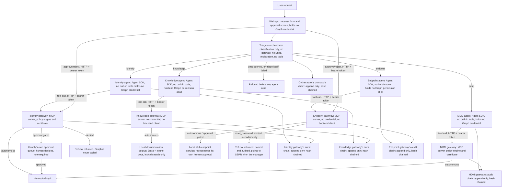

# Architecture and the decisions behind it

What this system is, how the repository is laid out, and why each design choice was made as it was.

Section titles quoted in the text, such as "Endpoint gateway notes", are the titles from the project's original single-file README; [the index](README.md) says where each one is now.

## What this is

This is a small identity helpdesk: a web form where someone can ask a question about group
membership or ask for a group membership change, an AI agent that answers the question or
requests the change, and a human approver who reviews and decides on any change before it
happens. The build contract is [SPRINT1.md](../SPRINT1.md); this file explains the design and
records what has been verified against a real Microsoft Entra tenant.

The problem it addresses is a specific one. Once an AI agent has a tool that can change a
production identity system, the interesting question is not whether the agent is well
intentioned. It is what happens when the agent is wrong, or has been talked into something by
a user, or hallucinates a plausible sounding request. A system built on "the agent decides, and
we hope it decides well" has no floor. This project is an attempt to put a floor under an agent
with real access to Microsoft Graph: a policy engine that the agent cannot argue with, an audit
log that the agent cannot edit, and a human in the loop for anything that changes state.

The claim this project makes is narrow and testable, not "the system is secure." It is: every
action the agent can request falls into exactly one of three classes, decided by code the model
never touches, and every one of those decisions, including refusals, is recorded before
anything happens as a result of it. The rest of this document explains why that claim is worth
making this way, then records the evidence for it.


Everything on that page is computed from the five audit chains described below, live, on every
render — no separate metrics store. It is the fastest way to see what this project actually does
without running any of it; see "Dashboard notes" and "Simulation run (Sprint 4 prep, pass one)"
further down for what backs every number on it.

Or watch it: a [5:23 silent walkthrough](../evidence/walkthrough.mp4) runs a request that resolves, one that waits at the
approval gate with a briefing, a refusal by a named rule, the operator console working a handoff, the dashboard,
and `prove-isolation` (see "A recorded walkthrough"). The two boundary checks are `pnpm prove-isolation` and
`pnpm prove-injection`.

The root README carries a simplified version of this diagram. The full one is below, with one correction: the version this section's text was written against drew a single "unsupported" refusal edge out of triage, which Sprint 4, section 1 retired in favour of `not_it`, `needs_human`, `network` and `security`. It is drawn here as it stands now, and the original is kept under it.



<details>
<summary>The diagram as it stood through Sprint 3</summary>



</details>


The certificate sits in the gateway, never on the agent side and, as of Sprint 2 Stage B, never
on the web app's side either. An agent that is talked into something still has no way to reach
Graph on its own, and every decision reaches the audit log before anything executes. Through
Stage A the approval executor held its own Graph credential in the web app rather than calling
back through the gateway, the one place this diagram simplified; Stage B closed that (see "Stage
B: the web app becomes a gateway client" below), and the diagram above reflects the closed state.
As of SPRINT3.md 3.3, the knowledge gateway shows that the floor holds even at zero: it has no
certificate, no Graph client, and nothing to reach with either, and it is still refused by the
same token validation as the other two if a foreign token is ever presented to it. As of 3.4, the
endpoint gateway holds no credential either, for a different reason: its one real backend is a
local stub, and its one Graph-shaped capability, password reset, was deliberately never built at
all — there is no Entra permission for it to hold, because there is no code anywhere that would
use one (see "Endpoint gateway notes" below).

As of SPRINT3.md 3.1, the web app no longer calls the identity agent directly: every request
first passes through triage, a classification-only function with no identity of its own, and the
orchestration layer that acts on its answer (see "Triage and orchestration notes" below). Triage can
only pick a destination, never grant a permission — the identity, MDM, knowledge and (as of 3.4)
endpoint agents downstream still hold their own credentials (or, for the knowledge and endpoint
gateways, none at all), their own gateways, and their own policy engines, and refuse whatever they
always refused. A wrong or manipulated classification changes which of those refuses a request,
not whether something does.

## Why enforcement is deterministic code, and the model is the exception path

The policy engine is a pure function. No network access, no model call, no randomness, no
system clock inside its own logic (time is passed in, not read). Given the same tool request
and the same configuration, it returns the same decision every time, and that decision can be
read straight out of the source code without running anything.

This is a deliberate rejection of the more common design, where a model is asked to judge
whether a request is safe and the judgment is trusted. A model's judgment is a distribution, not
a guarantee. It can be shifted by phrasing, by a long enough conversation, by a request that
looks unusually similar to ones it has seen approved before. None of that is a flaw you can fix
by writing a better prompt, because the underlying mechanism, a model producing a plausible
continuation, does not change. Deterministic code has a different failure mode: if a rule is
wrong, it is wrong the same way every time, in a way a reviewer can find by reading the rule.
That is a much better property for a control to have.

The model's job is narrower than "decide if this is safe." It is: understand what the user is
asking for in natural language, choose which tool to call and with what
parameters, and report the result honestly, including a refusal or a pending approval. The
policy engine's decision is not a suggestion the model can override or reinterpret; it is the
tool call's actual result. A denied response tells the agent plainly that nothing happened and
names the rule, and the agent's system prompt tells it not to retry, not to look for another
route, and not to claim a change was made when it was not. The one place a model's judgment
does carry real weight, understanding an ambiguous request and asking a clarifying question
instead of guessing, is exactly where judgment is appropriate: before a tool is ever called, on
a request that has not yet touched policy or Graph.

## Why policy configuration lives in git, not in `.env`

The break glass list (accounts no request may ever target) and the managed group allowlist (the
only groups `add_user_to_group` may touch) are both hardcoded in
`packages/identity-gateway/src/policy/config.ts` and committed to version control. This was a deliberate
choice against the more common pattern of putting this kind of configuration in environment
variables.

An environment variable can be changed by editing a file on a server, with no review, no
record of who changed it or when, and no diff to look at afterward. For most configuration that
is a reasonable tradeoff for convenience. For a break glass list or a group allowlist it is the
wrong tradeoff, because these are the specific values that decide whether the whole system's
main safety property holds. Putting them in git means a change to either one is a commit: it has
an author, a timestamp, a diff, and, in a normal workflow, a reviewer. Someone widening the
allowlist to include a group it should not include leaves the same kind of evidence a code change
would. The configuration is still validated automatically at startup (a malformed UPN or group id
in the file fails loudly rather than silently matching nothing), but the values themselves are
reviewable in exactly the way a `.env` file is not.

## Two known gaps carried forward from Sprint 1 — both now closed

**The web app held Microsoft Graph credentials directly. Closed in Sprint 2, Stage B.** When an
approver approved a request, something had to actually call Graph, and Sprint 1 had no HTTP
transport on the gateway for the web app to call into instead. So `packages/web/src/bin/web.ts`
built its own certificate credential and Graph client and called Graph itself. Stage B's HTTP
transport removed that entirely: the web app now holds no Graph credential and no `GraphClient`
at all, and reaches Graph only by asking the identity gateway (which still holds the one Graph
credential) to execute an already-decided approval — see "Stage B: the web app becomes a gateway
client" below.

**There was no `remove_user_from_group` tool. Closed in Sprint 2, Stage A.** `add_user_to_group`
was the only write Sprint 1 built, so every live demonstration in this document that changed
real tenant state had to be reverted by hand, with a one-off Graph call made outside this
codebase. `remove_user_from_group` now exists on the identity gateway (Component 3), approval
gated, the same class as the addition with no exceptions. It needed no new deny rule: extending
the existing rules' notion of "target group" to cover this tool as well as `add_user_to_group`
was enough for the directory-role and managed-allowlist deny rules to apply to it automatically,
confirmed in `policy/decide.test.ts` rather than assumed. The demo revert now runs through the
same audited, approved path as the change itself, instead of a manual escape hatch — exercised
live in the Sprint 2 verification run below.

## What Sprint 2, Stage A adds

Two disjoint identities: a second app registration, `helpdesk-mdm-gateway`, with exactly one
Graph permission (`Device.Read.All`) and its own certificate. A new package,
`packages/mdm-gateway`, exposing `list_devices` and `get_device` (both autonomous, no write
tools, its own policy engine and its own audit chain and database file). A second agent,
`packages/agent/src/mdm-agent.ts`, the identity agent's device-lookup counterpart — its own file,
its own system prompt, its own tool allowlist, no shared constant between the two (see "The MDM
agent, and the weaker boundary above the gateways" below for what that boundary does and does not
prove today). `pnpm prove-isolation`, committed evidence that Microsoft — not this codebase —
refuses a credential pointed at the other gateway's resource. And `remove_user_from_group`,
above.

## What Sprint 2, Stage B adds

HTTP transport on both gateways (`StreamableHTTPServerTransport`, stateless), replacing stdio,
with a bearer token validated on every request: signature against the tenant's published keys,
audience equal to that gateway's own Application ID URI, the `Gateway.Invoke` app role present.
Each agent gets its own app registration and certificate for the first time, scoped to its own
gateway's audience and carrying no Graph permission at all, so the agent-level tool boundary
Stage A's own README section called "our own code" becomes something Entra enforces instead —
`pnpm prove-isolation` grew two checks that prove exactly that, live. The web app losing its
Graph credential (above). `remove_user_from_group`'s demo revert exercised through the real web
UI with no manual Graph call, also above. See "Stage B: HTTP transport and token validation" and
"Stage B: the web app becomes a gateway client" below for the detail, and the Sprint 2
verification run for all of it exercised together in one session.

## Repo layout

```
packages/audit             the audit record format and its hash chain, shared, standalone
packages/handoff-core      as of SPRINT4.md, section 2: the generic handoff queue-item lifecycle
                           (open/taken/resolved, the required resolution note, the audit writing)
                           — standalone, the same layer as packages/audit and for the same reason:
                           two real writers (a gateway's own hand_off tool, and the orchestrator's
                           direct-creation path) need the identical mechanism and neither should
                           import the other's runtime. See "Handoff core notes" below
packages/gateway-core      as of SPRINT3.md 3.2: the shared spine every gateway is built from —
                           HTTP transport, MCP server wiring, token validation (auth/), the
                           validate/decide/audit/branch call order (tool-call.ts), the refusal
                           shapes, and a conformance suite (conformance.ts) any gateway can run
                           against itself. Carries no policy rules, no tool schemas, no
                           credential — a gateway with neither is a first-class case here, not a
                           workaround, because the knowledge gateway (3.3) needs exactly that. As
                           of 3.4, also the approval store, workflow and decision-listener
                           (approvals/) generalized off the identity gateway once the endpoint
                           gateway needed its own approval chain, not identity's — see "Gateway
                           template notes" below for what moved and what stayed identity-specific.
                           As of SPRINT4.md, section 2, also hand-off-tool.ts: the hand_off tool's
                           shared schema, description and execute() every gateway wires in
                           identically, built on @helpdesk/handoff-core
packages/identity-gateway  identity gateway: its own tool schemas, policy rules, Graph client,
                           and rationale generation. As of 3.4 its approval store, workflow and
                           decision endpoint are @helpdesk/gateway-core's, generalized, not its
                           own — this is the only package that holds a Graph credential; the Graph
                           plumbing (not the gateway mechanics, moved to gateway-core in 3.2) is
                           still shared with packages/mdm-gateway, see the header comments in
                           graph/client.ts and index.ts
packages/mdm-gateway       MDM gateway: its own tool schemas, policy rules and audit chain,
                           disjoint Graph permission and certificate from the identity gateway
                           (SPRINT2.md); built on @helpdesk/gateway-core the same way the identity
                           gateway is, as of SPRINT3.md 3.2
packages/knowledge-gateway as of SPRINT3.md 3.3: one tool, search_documentation, autonomous, on
                           @helpdesk/gateway-core the same way the other two gateways are — but
                           with no credential (env.ts asks for no certificate at all) and no
                           backend client, proving that case is first class rather than a special
                           path. Its "backend" is a local, vendored Markdown corpus (corpus/raw/,
                           Microsoft Learn documentation for Entra and Intune at a pinned commit —
                           see "Knowledge gateway notes" below for the commits and licenses) loaded
                           and lexically indexed once at startup (corpus.ts, search.ts), never
                           fetched at request time. As of Sprint 4 prep, corpus/raw/ is a folder
                           contract, not a hardcoded list: one subdirectory per product, each with
                           its own manifest.json naming its source repo, commit and license, and
                           `pnpm knowledge-reindex` (bin/reindex.ts) rebuilds from whatever is
                           present and reports what it found
packages/endpoint-gateway  as of SPRINT3.md 3.4: two reads and one approval-gated write against a
                           small local stub endpoint service (stub/endpoint-service.ts), openly
                           marked as a stand-in rather than a real integration — see "Endpoint
                           gateway notes" below for what a real one would need. Also reset_password:
                           declared as a tool so the refusal is nameable and auditable, but denied
                           unconditionally by policy/decide.ts before any execute() path is ever
                           reached, and never granted any Graph permission at all. Like the
                           knowledge gateway, holds no credential of its own — for a different
                           reason: its one real backend needs none, and its one Graph-shaped
                           capability was deliberately never built
packages/agent             four agents, one file each (identity-agent.ts, mdm-agent.ts,
                           knowledge-agent.ts, endpoint-agent.ts), on the Claude Agent SDK;
                           deliberately not one parameterized implementation (see mdm-agent.ts's
                           header comment); each holds its own certificate, scoped to its own
                           gateway's audience — except the knowledge and endpoint agents, each the
                           only credential anywhere near its own gateway, since neither gateway
                           holds one. None of the four has any Graph permission of its own.
                           As of SPRINT3.md 3.1, also triage.ts (classification only, no
                           identity of its own) and orchestrator.ts (calls triage, then the
                           matching agent), with its own audit chain, orchestrator-audit.ts. As of
                           3.3, triage's output also carries one boolean, partiallyOutOfScope —
                           see "Triage and orchestration notes" below for why that does not weaken
                           triage staying outside the trust boundary. As of 3.4, a fifth category,
                           endpoint, covers both the stub fleet and every password reset request.
                           As of SPRINT4.md, section 1, triage.ts makes two decisions (not_it /
                           needs_human / routable, then category); section 2 has orchestrator.ts
                           create a real handoff directly for needs_human, via
                           @helpdesk/handoff-core, with no gateway and no policy decision in
                           between — see "Handoff core notes" below. All four agents now also carry
                           hand_off in their own allowedTools, each with its own system-prompt
                           wording for when to call it (agent-boundary.test.ts keeps the four
                           prompts genuinely separate texts, not a shared constant).
                           As of 3.5, also models.ts: the pinned model for triage and for the four
                           agents (a new DEFAULT_AGENT_MODEL), and the reasoning for both tiers
                           gathered in one place alongside the rationale generator's — see
                           "Dashboard notes" below
packages/web               request form, approval screen and (as of 3.5) dashboard, server
                           rendered; holds no Graph credential (SPRINT2.md, Stage B) — reaches
                           Graph only by asking the identity gateway to execute an already-decided
                           approval. As of 3.4, reads and decides approvals across two gateways
                           (identity, endpoint), not one — see "Web app notes" below. As of 3.5,
                           also reads all five audit chains (adding the orchestrator, mdm and
                           knowledge databases to the two it already opened) to render
                           `/dashboard` — see "Dashboard notes" below
data/                      SQLite, gitignored
```

`packages/identity-gateway/src/index.ts` documents the rules for its consumers (the agent package
and the web app) in detail — see that file for exactly which runtime values each may import and
why. The short version: everyone gets type definitions freely; the one shared runtime credential
class (`CertificateCredential`) is a deliberate, narrow exception for the agent package and the
web app, both of which use it only to authenticate to a gateway, never to Graph; nothing outside
`packages/identity-gateway` imports `GraphClient` or its own policy engine. As of SPRINT3.md 3.2,
the generic gateway mechanics that document used to also cover — `openDatabase`, `TokenValidator`,
`JwksClient`, `createRequestListener` — no longer live here at all: they moved to
`@helpdesk/gateway-core`, a neutral package every gateway depends on directly, the same way they
already depend on `@helpdesk/audit-core` directly rather than through one another. As of 3.4,
`ApprovalStore`, `ApprovalWorkflow`, `ApprovalError` and the decision-endpoint types moved there
too, once the endpoint gateway needed its own approval chain — they are no longer identity-specific
exports at all, and the web app now takes them from `@helpdesk/gateway-core` directly, the same
way it already took `openDatabase`. See "Gateway template notes" below for the full extraction.
